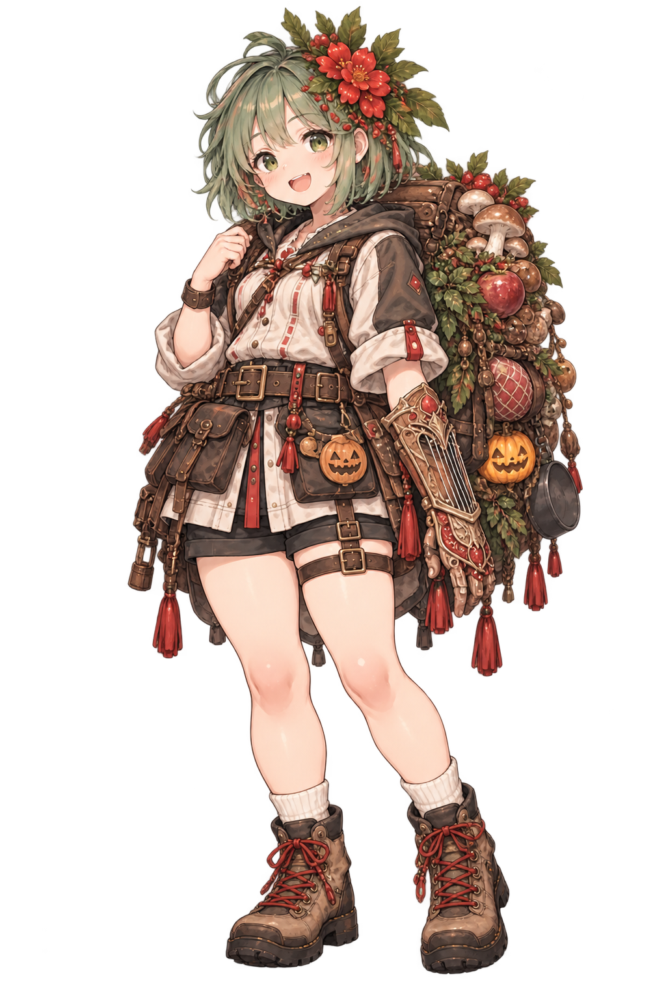
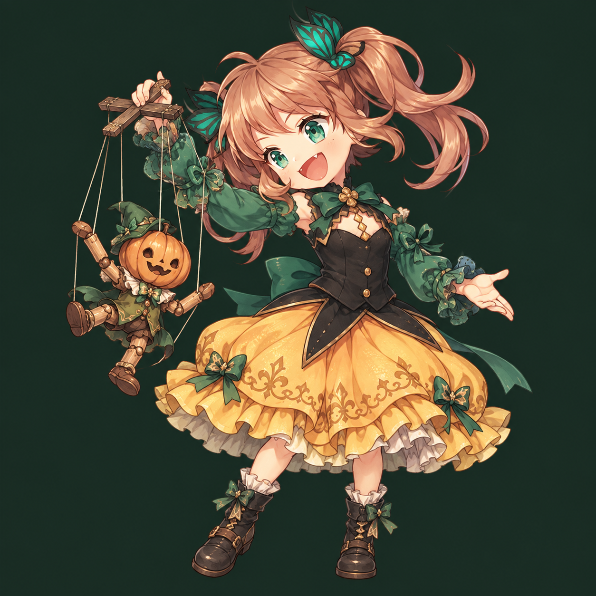

# オリジナルキャラクターの立ち絵一覧

案内：[人物画像](character-images.md)

指定された参考絵に合わせて修正した立ち絵。
制作方法は組み込み image_gen。[メリルの採用シートからの生成記録](../art-generation/chapter-four-runtime-sprites.json)・[以前の自然なポーズの修正記録](../art-generation/merrill-relaxed-gag-prompts.json)・[パンプティの最終プロンプトと参照画像](../art-generation/original-character-art-v2-prompts.json)・[制作記録](original-character-art.md)。

## メリル

装具の形は[採用リファレンスシート](../characters/merrill-reference-sheet.png)を参照する。本人の左腕だけに装備し、手の甲側から全指の指先まで覆うガントレットそのものが琴。手のひらと指の腹は開け、弦は前腕の甲側にだけ張られる。右手は素手。立ち絵は演奏せず、左腕と手首を自然に保つポーズ。外見・材質は[人物設定](../characters/merrill.md)と採用シートを正とする。

## パンプティ（プティ）

`502328_e13571_pinup.jpg` を優先。黒い身頃、緑の袖、黄色いスカート。ツインテールと八重歯、人形遣いの道具。

