# シナリオスチル一覧

案内：[アート・音](README.md)

章・ステージ順に掲載する。同じステージでは出発会話、達成会話の順。表示条件の正本は `lib/story-art.ts` と各章の実装仕様、制作履歴は [スチル制作記録](story-art.md) を参照。

## 第一章

### 1-1：荷物を渡したら

リンデの店先でアリアが薬草を渡し、レオンが村から預かった交易品を台に置く。`village-trade-return` の最初の行から表示。2026-10-05に最新のアリア・レオン設定画へ更新。[更新記録](../art-generation/trade-handover-refresh-20261005.json)を参照。

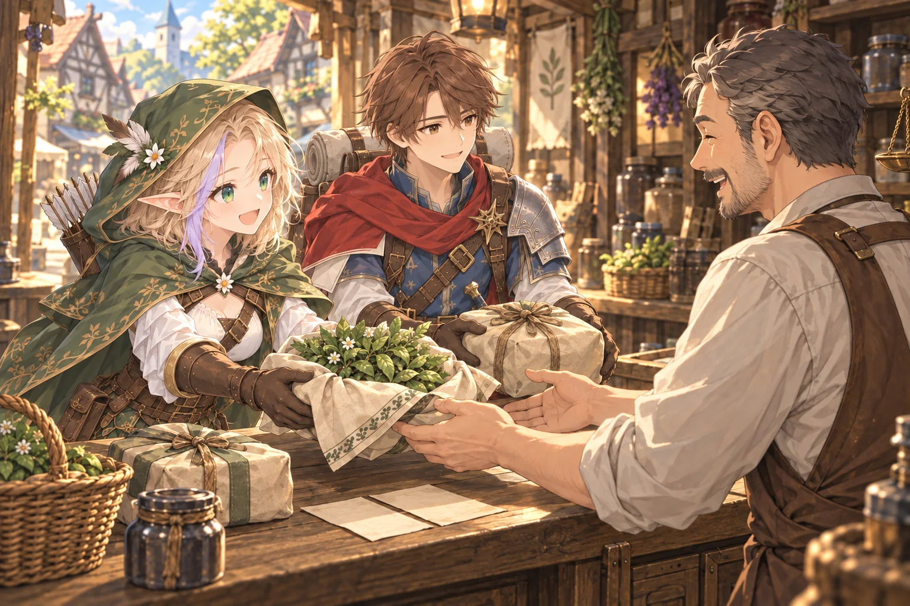

### 1-4：石陰の拾いもの

第一章1-4。管理人の許可を得て分けた光る苔が、小さな木の入れ物で手元を照らす。二人の顔と苔灯に寄った構図で、2026-10-05に最新設定画へ合わせて描き直した。アリアの肩〜鎖骨丈の金髪と花飾りの反対側の紫の一房、レオンの短い片肩マント・背嚢と巻き毛布を反映した。この絵の生成プロンプトと背景・苔灯の記録は [制作記録](story-art.md#第一章1-41-5) を参照。

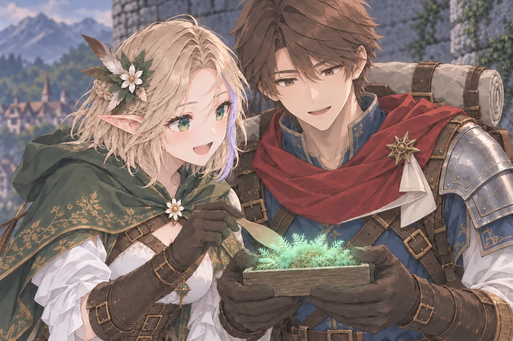

### 1-6：同じかもしれない

第一章1-6。2026-10-05に最新設定画のアリアへ更新。木漏れ日と苔むした石壁を背景に、フードをかぶったアリアが両手の器を顔の近くまで持ち上げて二つの苔を見比べる。短い金髪と画面左側の紫の一房を反映し、構図を保って元気な笑顔へ修正した。持ち上げる行から表示し、まだ同種とも塔の不調の原因とも断定しない。[背景の制作記録](../art-generation/stage-1-6-art.json) と [更新記録](../art-generation/forest-moss-refresh-20261005.json) を参照。

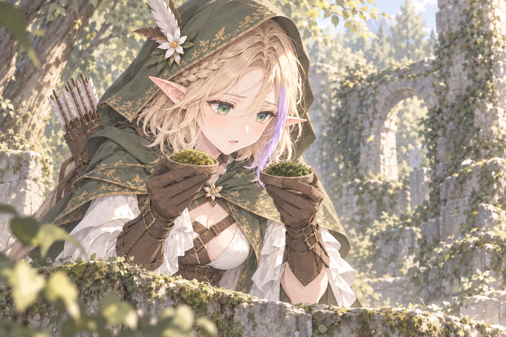

### 1-9：灯りの戻る丘

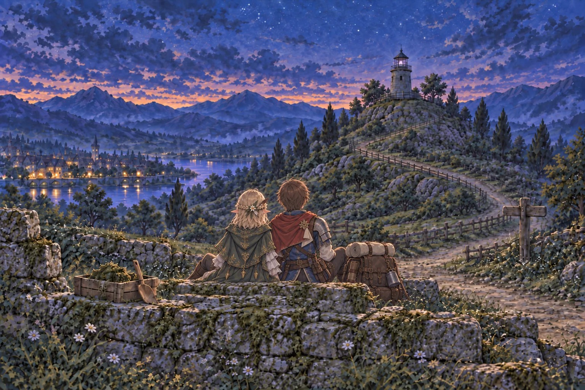

第一章1-9。塔に淡い紫の光が戻る行で表示。2026-10-05に最新設定画に合わせた再作成版を採用。アリアはフードを下ろし、肩〜鎖骨丈の金髪と花飾りを見せてレオンと寄り添って座る。アリアのマント背面は無地の緑にし、レオンの背面にもバッジを置かない。レオンは短い片肩マントと、横に置いた背嚢・巻き毛布を持つ。二人は正面の塔を見上げ、窓には弱い紫の灯りがともる。[更新記録](../art-generation/tower-restored-refresh-20261005.json)と[初版の制作記録](../art-generation/stage-1-9-art.json)を参照。

## 第二章

### 2-2：あと一人分の包み

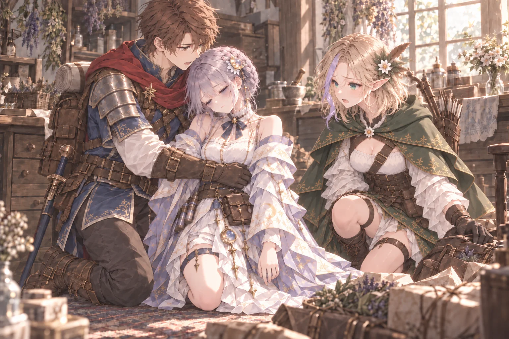

`moonlit-herbs-return` の倒れる行から表示。2026-10-05に最新設定画へ合わせ、ミラの薄紫のまとめ髪と疲れた顔、アリアの短い髪、レオンの短いマントを更新した。[更新記録](../art-generation/mira-collapse-refresh-20261005.json)と[スチル制作記録](story-art.md#第二章2-2ミラが倒れる)を参照。

### 2-6：もう一人の山賊

ハロウィン風に飾った人形がお辞儀し、パンプキンヘッド姿のプティが後ろから操る。`begging-golem-departure` の0起点3行目から表示。[制作記録](story-art.md#第二章2-6大小の人形)を参照。

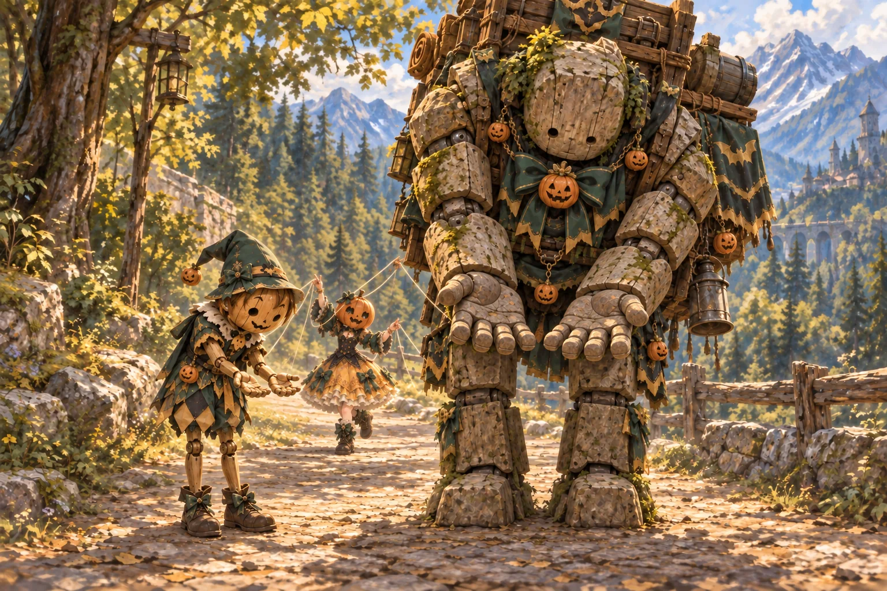

### 2-8：薬を待つ家々

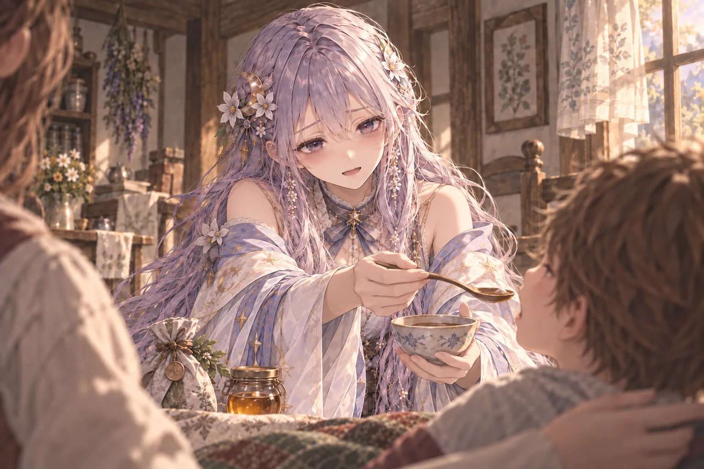

第二章2-8。ミラが子どもの口元へ薬の匙を運ぶ行から表示。

### 2-9：三人分のお茶

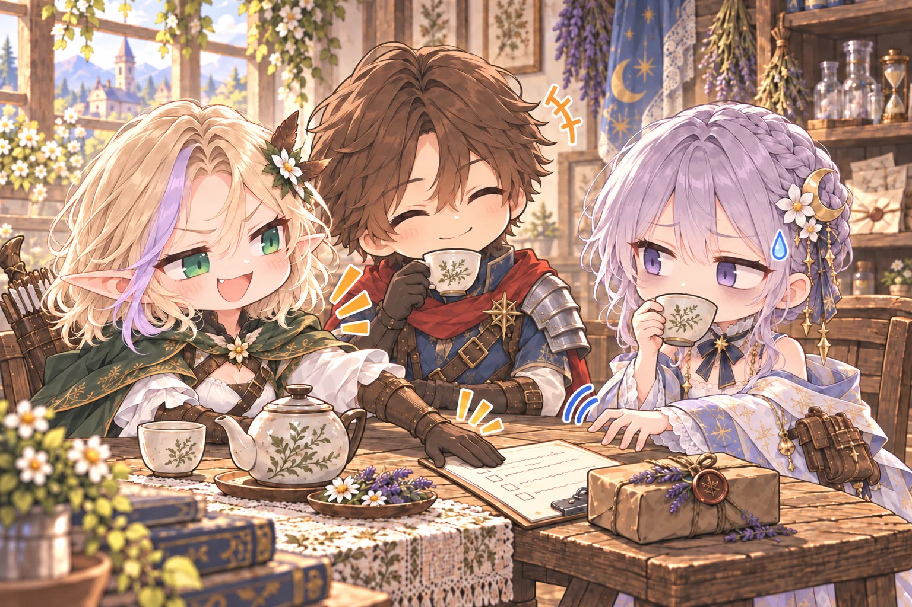

第二章2-9。ミラがカップを受け取り一口飲む行から表示。2026-10-05に最新設定画へ更新し、アリアの短い金髪と薄紫の一房、ミラのまとめ髪、レオンの短い片肩マントを反映した。三人のお茶と仕事のメモをめぐるコミカルな仕草を保つ。[更新記録](../art-generation/three-cups-refresh-20261005.json)を参照。

## 第三章

対応する先行会話は[スチル制作記録](story-art.md#第三章食堂手当て四人のお茶)、ゲームへの接続状況は[第三章の実装仕様](../gameplay/chapter-three-gameplay.md#実装状況)を参照。

### 3-1：食堂で頬杖をつくフィン

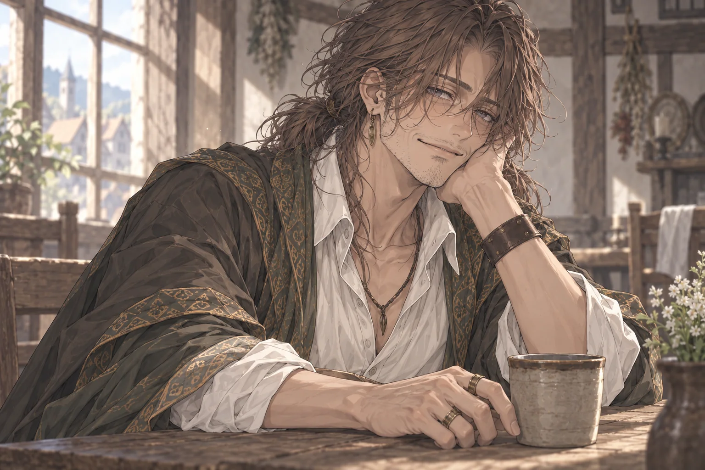

### 3-8：ミラの手当て

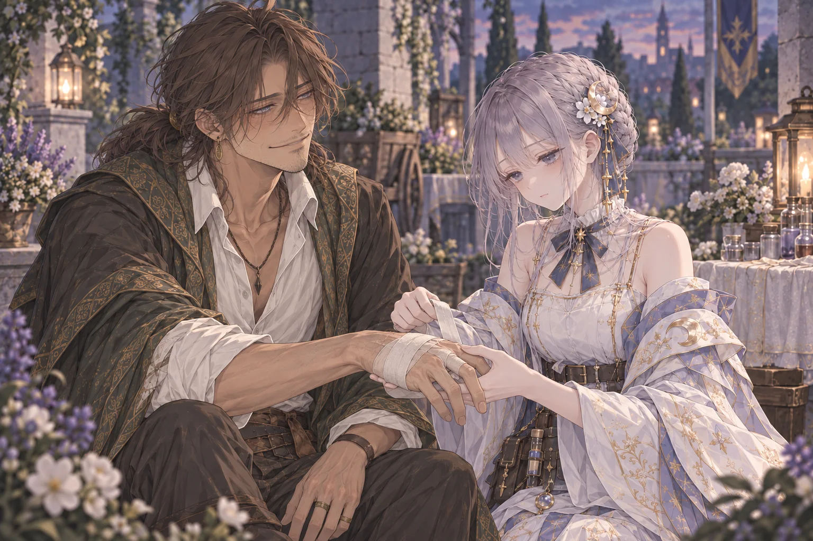

`keystone-night-road-departure` の手当ての行から表示。2026-10-05に最新設定画へ合わせ、フィンの簡素な毛束と低い結び髪、ミラのまとめ髪と疲労のにじむ目元を更新した。右手の指を動かせる薄い包帯と、二人の表情・動作を保つ。[更新記録](../art-generation/mira-tends-finn-refresh-20261005.json)を参照。

### 3-9：四人のお茶

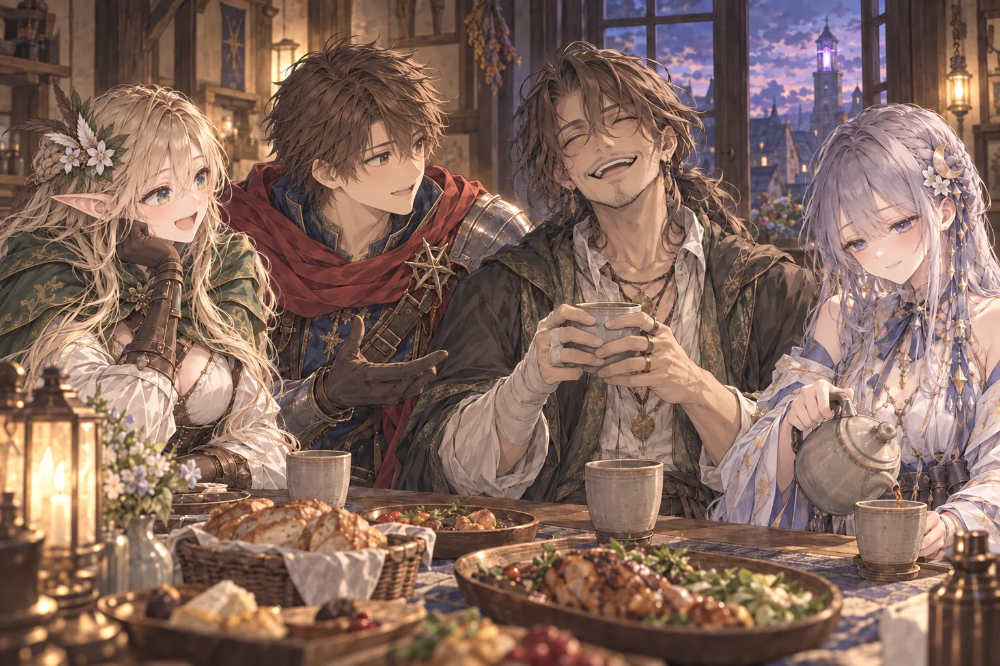

## 第四章

[制作条件](chapter-four-stills.md)と[生成記録](../art-generation/chapter-four-stills.json)を参照。

### 4-4：徹夜明けのミラ

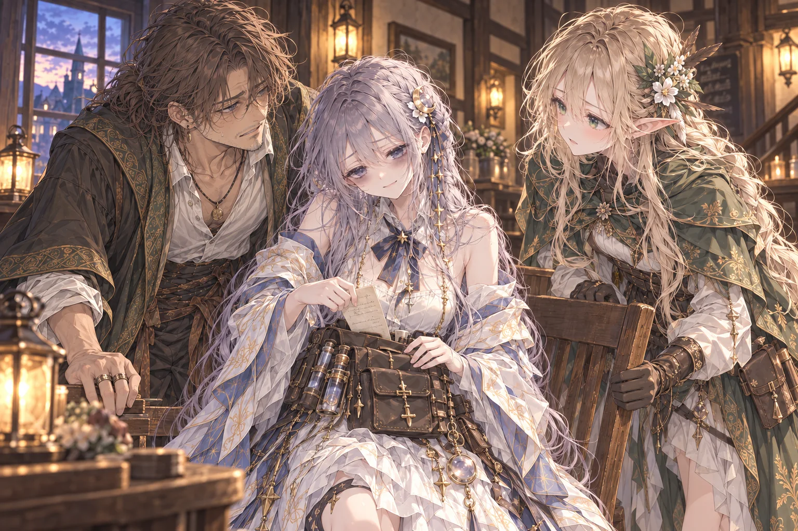

### 4-4：青い布の陰

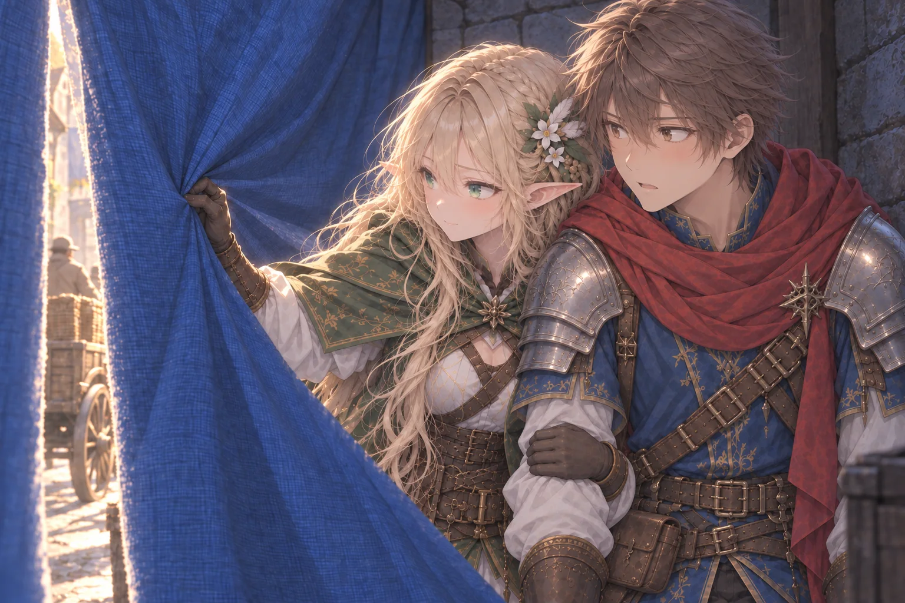

### 4-8：苗を守るリコ

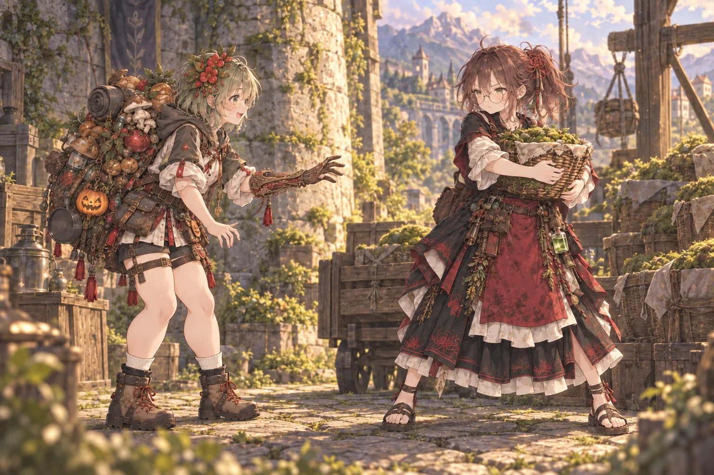

第四章4-8の出発会話で表示。人物紹介を兼ねた全身構図で、右のリコが苗を守り、左のメリルが狙う。[制作条件](chapter-four-stills.md#4-8の採用画像)と[生成記録](../art-generation/chapter-four-stills.json)を参照する。

### 4-10：旅団結成

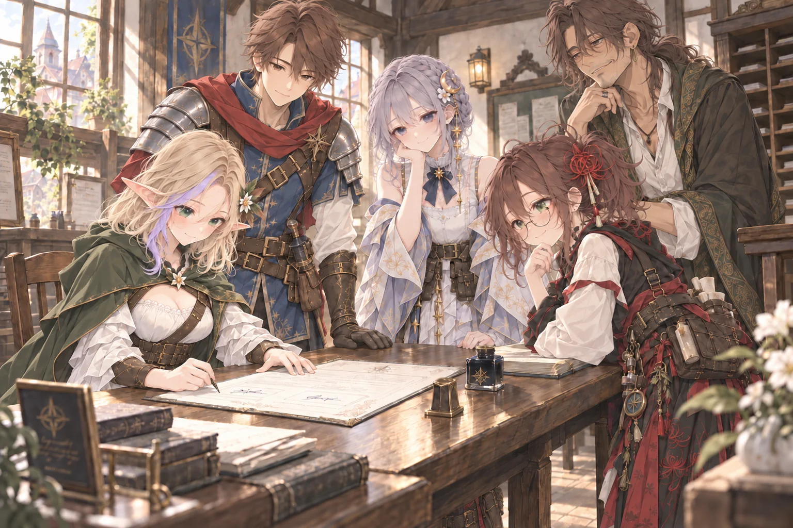
