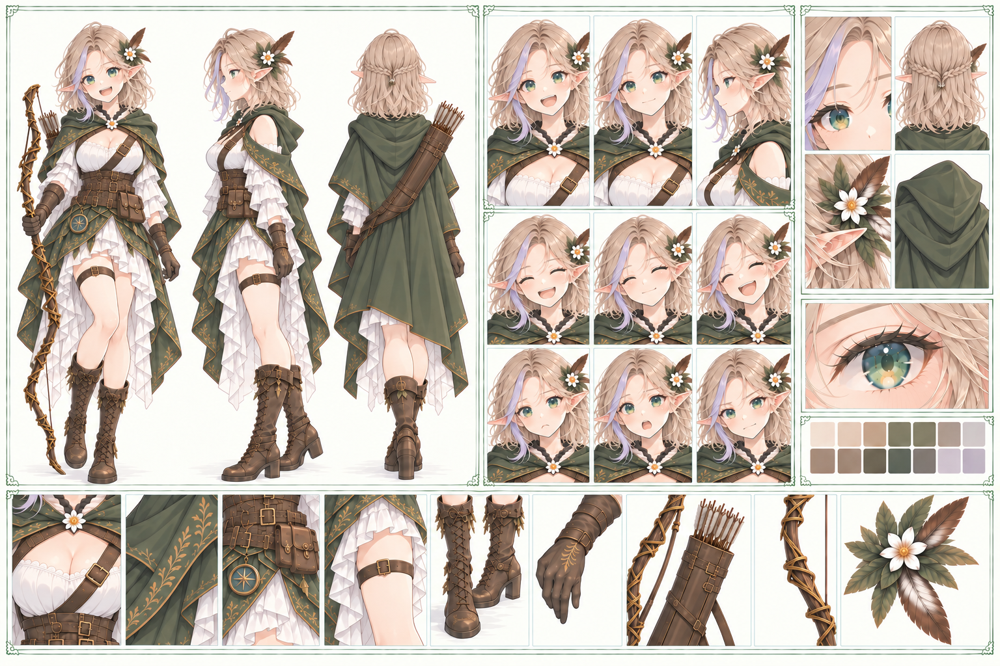

# アリア `aria`

キャラID: `aria`

[キャラクター一覧・設定の扱い](README.md) · [物語・会話の制作指針](../story/story-writing.md)

風読みのレンジャー。採取の達人。

## 採用済み

- 風の匂いで薬草を見つける。方向音痴であることは秘密にしたい。
- 気になるものを見つけると先に足が動く。間違いを認める前に、つい強がる。
- 仕事でも、全体を確かめる前に「できる」と請け合うことがある。見込み違いに気づけば自分で謝り、段取りのやり直しも引き受ける。1-3の配達で具体化済み。場面の根拠は [二人の実装記録](../relationships/aria-leon.md#関連するプロット実装) を参照。
- レオンが隣にいる未来を自然に思い描くが、自分からふたりきりの約束をするには勇気がいる。
- 胡桃のパンと蜂蜜のお菓子が好き。レオンに好みを覚えていてもらえるとうれしい。
- レオンから昔もらった髪紐を持っている。花びらを手帳にはさみ、見つけた石を分け合う。
- レオンの袖を繕う。世話を焼かれるだけでなく、自分も彼を見ていることを伝えたい。

## 書くときの手がかり

一人称は「私」、レオンは「レオン」。短い問いかけや「ねえ」「でしょ」で相手を会話に誘う。強気な言葉のあとに、小さな本音を置ける。照れるたびに怒鳴る人物にはしない。

行動の軸は「見つけたものを、一緒に見たい」。レオンへの好意は、発見を分けることや次の予定に彼を含めることで表せる。

### 口癖・台詞の型

- 思いつきが形になる前から、嬉しそうに「ね、いいこと思いついた！」と言う。寄り道や失敗の前触れだけにはせず、本当に問題を動かす発見や、誰かを喜ばせる提案にも使う。
- 台詞は「勢いよく言い切る → あとから条件や本音を一言足す」という形が似合う。「任せて！　薬草のことならね」「一人でも行けるよ。レオンと行きたいだけ」のように、付け足した方へ本音がにじむことがある。
- 感謝や褒め言葉も考える前に出る。「それ、似合う」「ありがとう」を素直に言えたあと、その意味を意識してから照れることもある。
- 困難な場面では「まだ、試してないでしょ？」が決め台詞。根拠なく成功を断言するのではなく、まだ残っている可能性を見つけて一歩進むアリアらしさとして使う。1-6で苔を塔へ戻す案（`forest-wetland-return`）、2-7で人形を誘って動きを確かめる提案（`sweet-blockade-departure`）と、章ごとに一度ずつ効かせている。
- 第二章では「ね、いいこと思いついた！」「任せて！」と、言い切ったあとに条件や本音を付け足す構文を普段から積極的に繰り返す。山場では「まだ、試してないでしょ？」も使う。全ての台詞へ機械的に入れず、普段の反復で覚えてもらった言葉を恋愛や節目で少し崩して効かせる。具体的な場面は [第二章計画](../story/story-part-2.md) の合意済み会話案を参照する。

公開済み第一章では、村の交易の仕事でレオンと街へ向かい、道中の薬草も採る。苔灯の変化から森の苔との似かよりを思い出し、交易日を待たずに見比べる約束をする。植生の観察を塔の原因調査へつなげ、苔の撤去では試しながら剥がし方を変える。共通の出来事と根拠は [二人の関係性](../relationships/aria-leon.md#関連するプロット実装) を参照する。

## 人物を深める軸

新しい景色を追いかける一方、レオンがいつも合わせてくれていたと気づき、彼の行きたい場所を自分から聞く。

思いつきや感想がすぐ口に出る性格を、今後も長所と失敗の両方に使う。口走った約束の後始末を自分でも担うところは1-3で具体化したが、一度の反省で早合点する癖を克服したとは扱わない。遠慮のない一言だけでなく、感謝や褒め言葉も早い。詳しくは[「ふたりの性格を動かす仕組み」](../relationships/aria-leon.md)を参照。

## レンジャーと迷子（第二章以後の制作方針）

レンジャーは弓の使い手に加え、野外の探索・追跡・植物の知識・採取に長ける人物として扱う。アリアは採取方向の育成も持たせる。技の候補は [第二章計画](../story/story-part-2.md) に置き、戦闘技を選んだことで植物の知識を失う描写にはしない。

草や風は読めるのに、目当ての草を追って帰り道を見失う、という得意分野と方向音痴の食い違いを残す。能力が伸びても、早合点や迷子の癖を無難に直すことを目標にしない。

本人は方向音痴を秘密にしたいので、迷った事実を語らせるより、**話をそらす動作**で見せる。2-5達成後（`spinning-signpost-return`）では、踏み跡から正しい道を言い当てた直後にレオンへ「帰りは？」と聞かれ、答えずに菓子の盗難へ話題を移している。迷子そのものを描かなくても、この食い違いは一往復で出せる。

迷子で一時的にパーティから離れ、思わぬ場所で復帰する展開は将来の候補。第二章には入れず、離脱の保存仕様や参加者の変更も第二章の計画には含めない。

## 関係性・関連する人物

[レオンとの関係](../relationships/aria-leon.md)、[ポピー](poppy.md)。

[関係性の一覧と既存の掛け合い](../relationships/README.md) も確認する。関係性の共通本文はここへ複製しない。

## 制作案・未設定の確認先

[塔の物語で人物を動かす軸](README.md#塔の物語で人物を動かす軸) と [共通の未設定事項](README.md#共通の未設定事項) を参照する。第一章の二人以外の登場・加入案は第二章以後として扱う。

ふたりの出身・現在の仕事・失敗と成長は [アリアとレオン](../relationships/aria-leon.md) にまとめる。制作案は現行実装と区別する。

## 外見・関連資料・実装

### リファレンスシート

GPT Imageで作成した外見・衣装・装備の制作参考。長い金髪とエルフの耳、緑の目、森を思わせるマントと軽装、弓・矢筒、白い花の髪飾りを主な方向性として扱う。

シート内に自動生成された年齢・身長・職業・台詞などの文字情報は、確定設定として扱わない。人物設定の正本は本ファイルと関連資料を優先する。

[プロフィール・既存ペア](../../lib/roster.ts)、[物語・道中の掛け合い](../../lib/stories.ts) をキャラIDで確認する。外見の追加設定は既存の画像・制作記録を確認してから行う。

[動作画像の制作記録](../art/hero-animation-art.md)、[スチル制作記録](../art/story-art.md)、[スチル一覧](../art/story-art-gallery.md) を参照する。

数値・加入条件・表示条件の最終的な正は [現在のゲーム](../../lib/game.ts) と各シーンの実装。資料整理だけでゲームやセーブの内容は変わらない。
