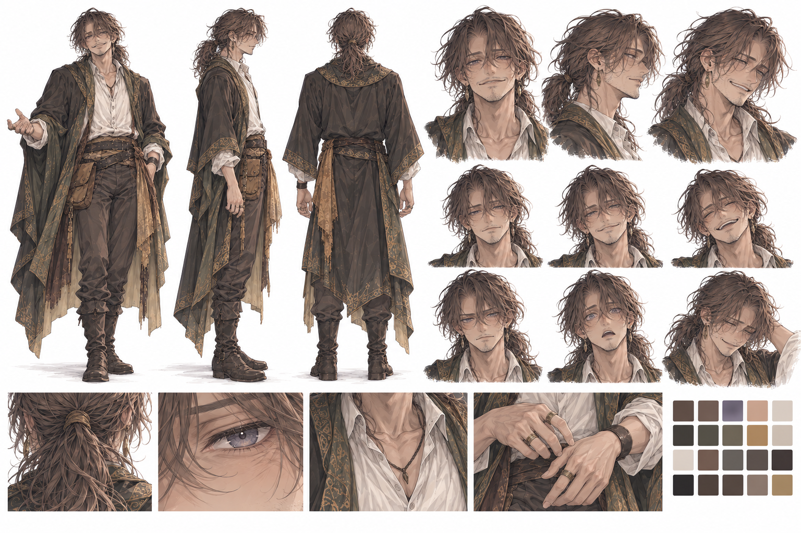
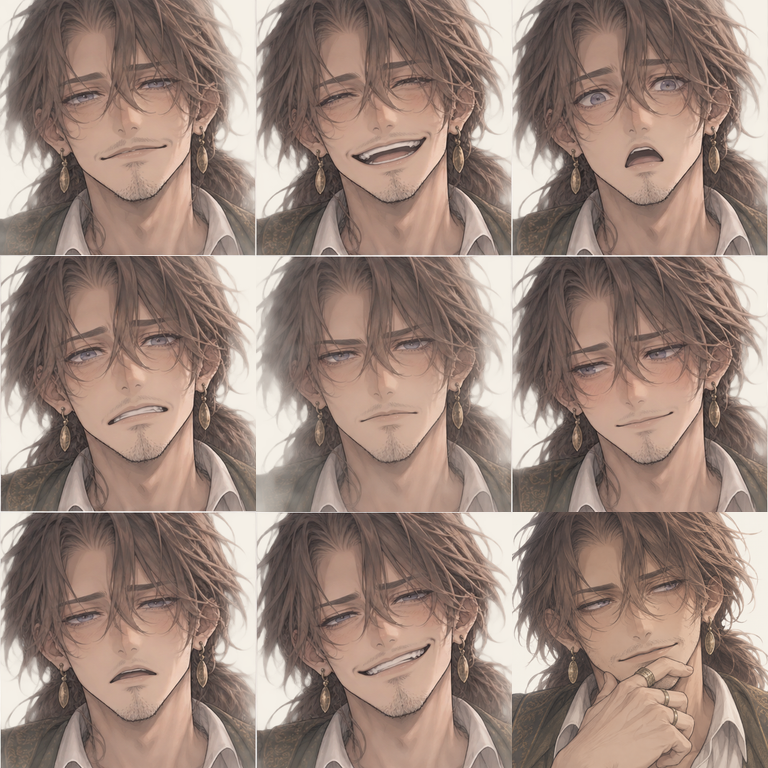

# フィン（フィネアス） `finn`

キャラID: `finn` ／ 表示名: フィン ／ 名乗り: フィネアス

[キャラクター一覧](README.md) · [第三章計画](../story/story-part-3.md) · [執筆指針](../story/story-writing.md)

胡散臭い中年の仲介人。情報通で、盗みとすり替えの腕を持つ。だらしなく、手癖も悪いが、ひょうひょうと仕事をする。

## 制作の核

- 四十代後半の男性。無精髭、日焼け、目尻の皺、垂れ目のへらへら笑い。昔は上等だったはずの外套がくたびれている。安物の指輪は「預かり物」と言う。
- 荷物が少なく、足りない物はその場で借りる。借りた物を又貸しして返却が遅れるなど、生活のだらしなさに実害がある。
- 一人称は「俺」。親しげに距離を詰めるときに「おじさんが」と言う。アリア、レオンくん、ミラ先生と呼ぶ。レオンは章を通して「フィンさん」と丁寧語。
- 相手が勘違いすると分かっていて、都合のよい部分だけ話す。事情を小出しにし、自分が取引に関わったことも後から認める。
- 盗みをすべて人助けとして正当化しない。手癖で鍵や紙を持ち出すことがあり、仲間に戻すよう言われる。得た情報が役に立ったからといって、出所の説明が済んだつもりにならないよう、周囲が突っ込む。
- 山場も普段の軽い口調。突然無口な凄腕に変身せず、世間話の続きのように難しい仕事を済ませる。
- 腕は頼れるが、説明が全部とは信じられない。加入しても、その距離感を残す。

## 情報の集め方

各地に自分を待っている人がいると、得意げに言う。**実際に待っているが、待っているのは取り立てる側**。借金や借りた道具の返却を待つ人の顔も、本人は立派な人脈として数えている。

各地の商人、荷運び人、宿や食堂の人、使用人、債権者などに知り合いがいる。貸し借りも未払いも混ざる。名前や具体的な関係を覚えているので、人をたどれる。

酒場では酔客と愛嬌よく話し、道の不便、荷物の行き先、商人の自慢などを拾う。盗み聞きや、手癖で持ち出した控えから知ることもある。情報は鋭いが、伝聞は確認を要し、出所も伝える順番も怪しい。何でも知っている人物にはしない。塔や石の専門知識、調査、準備、運搬は仲間や現地の人に頼る。

第三章では、第一章の塔が直って往来が戻った話を荷運び人から聞いている。顔は知らず、食堂で三人の会話を聞いて二人に気づく。若者だから無差別に仕事を勧めたのではなく、石の売買と塔の不調を調べる手がかりとして、実際に塔を直した経験へ期待して近づく。

## 大げさな話と、伏せる話

見張りの人数や手柄を大げさに、自分の迷惑や怪我を小さく言う。相手や場面に合わせて話を盛り、事実の一部を伏せることもある。

名乗りが長くなるギャグは使えるが毎回の義務にはしない。名乗り、数字、肩書きは立派でも、実際の用事は鍋を返すことだった、という具体的な落差を大切にする。

| 台詞の型 | 使いどころ |
| --- | --- |
| 「まかせとけって」 | 軽く請け合う。実際に腕が必要な場面にも使う |
| 「いやあ、参ったね」 | 都合が悪い話をごまかす。反省の代わりにはならない |
| 「時と場合によるねえ」 | 肝心な部分をぼかす |
| 「おう。だから、そろそろ帰ろうか」 | 仕事を済ませたあとも普段の調子 |

## だらしなさと仕事の腕

食堂の代金も、足りない道具と同じ調子で借りる。第三章ではレオンに食堂代を出してもらい、既に使った仲介料を当てにして、交換用の石まで自分の借りで買う。「次の仕事が済んだら」と請け合うが、章末にも食堂代は返していない。仕事をやり遂げても、金銭や借り物のだらしなさは残る。

鍵の扱い、指先のすり替え、人の注意や視線の動きを読むことが得意。離れた場所の物を魔法で交換する能力とはしない。物の大きさ、布、持ち運び、開閉のタイミングが必要で、仲間が作る隙を使う。すべて一人で準備済みにして、他の三人を観客にしない。

自分の怪我は「かすり傷」と後回しにする。ミラは言葉より手の動きや血を見て判断し、仕事を続けるためにも処置する。彼女自身も休息を後回しにするため、フィンがお茶を頼んで一緒に座る口実を作ることがある。両者の癖を一度で治さない。

## 同行を続ける理由

第三章の事件では、フィンだけでは必要な石を識別・比較して無事に戻せず、三人だけでは情報をたどってすり替えることができない。四人で一件を終え、互いの腕が必要だと分かったので、次の仕事も一緒にすることを選ぶ。

恩返しだけ、借金返済だけ、三人に信用を保証してもらうだけの加入にしない。自分から「次も話を持ってきていいか」と持ちかけ、自分も同行する。

## 関係性・未設定事項

アリアとは面白そうな話を膨らませることがあるが、彼女は事情の後出しを怒り、自分でも確かめる。レオンは腕を認めても、控え・物・帰路を確認する。ミラに世話を焼かれ、ときには彼女を休ませる口実も作る。誰か一人を常に保護者にしない。

アリアとレオンの好意は代弁しない。重い過去、隠された正体、本名、家族、借金総額は未設定。

## 外見・関連資料・実装

人物設定はこの資料を正本とする。

リファレンスシートを作る際の方向性：四十代後半の男性、無精髭、日焼け、目尻の皺、垂れ目、へらへらした笑み。**荷物は少なく、身ひとつに近い身軽さ**。昔は上等だった外套が擦り切れている。指の安物の指輪、片方だけ質の違う手袋など、その場で借りて揃えた不揃いさを出す。旅装が重装備に見えないようにする。

数値・加入条件・表示条件の最終的な正は [現在のゲーム](../../lib/game.ts) と各シーンの実装。資料整理だけでゲームやセーブの内容は変わらない。

### リファレンスシート

採用した外見は上のリファレンスシートを基準とする。四十代後半の、整った顔立ちと気の抜けた笑いを併せ持つ男性。暗い茶色の波打つ髪を低い位置でゆるく結び、頬にかかる前髪を残す。瞳は落ち着いた灰紫。日焼けした肌、無精髭、目尻の皺、垂れ目を保ち、皺や鼻を誇張した老人顔にはしない。

細身の体格に、くたびれた暗いオリーブ・チャコールの外套、控えめな古金色の縁飾りと黄土色の裏地、生成りの開襟シャツ、茶系のズボンと革ブーツを合わせる。安物の指輪や耳飾りを含む外見はリファレンスシートを基準にし、荷物や装備を増やして重装備にしない。へらへらした笑みと、叱られて困った表情を同じ顔立ちで描き分ける。

ミラのシートから参照するのは、線の細さ、塗りのやわらかさ、色の落ち着き、光の表現、髪と瞳の描き込み方だけ。人物・髪型・衣装・ポーズ・固有色はフィンの設定と採用した外見を優先する。

シートは文字なしで、全身の正面・側面・背面、顔の正面・横顔・斜め45度、通常・微笑み・喜び・真剣・驚き・困り顔、髪・瞳・衣装・小物の拡大図、固有色の色見本をまとめる。制作条件は [生成記録](finn-reference-sheet-generation.json) を参照。ゲーム内の顔アイコン・動作画像への反映は、この設定資料の追加には含まない。

### 顔アイコン

リファレンスシートに合わせた、文字なしの9表情。上段は通常・笑顔・驚き、中段は困り・真剣・照れ、下段は疲れ・ニヤリ・思案。通常は気の抜けた軽い笑み、困りは話を盛ったことを指摘されてごまかす顔、照れは不意に褒められたときの気まずさ、ニヤリは調子よく話を持ちかける顔として描き分ける。髪色・灰紫の瞳・日焼け・無精髭・顔立ちを各コマで揃える。

768×768px、3列×3行、1コマ256px角のWebP（配信用の品質82）。顔を大きく見せ、髪や耳の端の切れを許容するアップ構図へ更新した。現在の制作条件は [アップ画像の生成記録](../art-generation/mira-finn-closeups-generation.json)、初版は [生成記録](../art-generation/finn-expressions-generation.json) を参照。台詞との接続範囲は[第三章の実装仕様](../gameplay/chapter-three-gameplay.md#実装状況)を参照する。

追加の「思案」は、顎に指を添えて話の持っていき方を考える表情。半目の流し目と控えめな片笑いで、ニヤリ顔とは違う静かな胡散臭さを出す。9表情シートの右下に収録し、`expressionPortrait("finn", "thoughtful")` で他の表情と同じAPIから取得する。制作条件は [生成記録](../art-generation/finn-thoughtful-generation.json) を参照。
