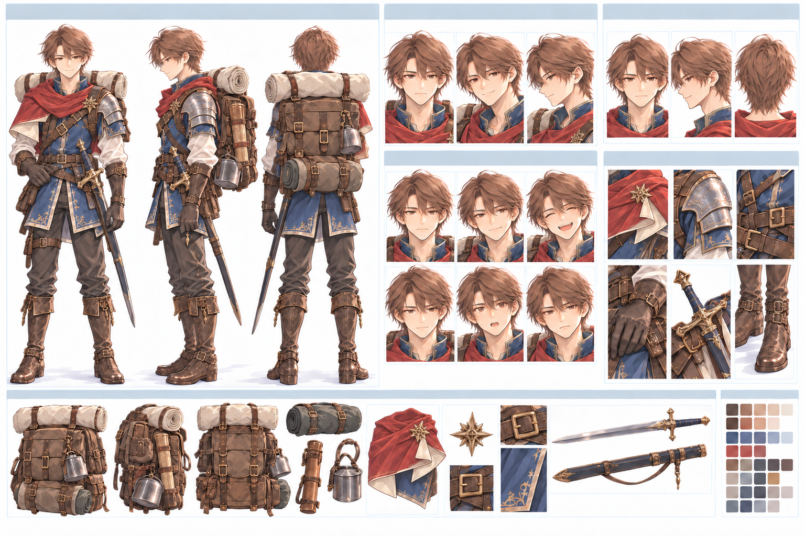

# レオン `leon`

キャラID: `leon`

[キャラクター一覧・設定の扱い](README.md) · [物語・会話の制作指針](../story-writing.md)

暁の剣士。魔物との戦いが得意。

## 採用済み

- 真面目で、地図より仲間の言葉を信じる。
- 人の荷物や足元を自然に気にかける。自分の望みを聞かれると、言葉を選びすぎる。
- アリアの好物や昔からの癖を覚えている。大切にする理由を「幼なじみだから」で済ませがち。
- アリアのために席を空け、好物を取っておく。明日や明後日も一緒にいるつもりで話す。
- 蜂蜜のお菓子が好き。帰ったら食べたいものとして、アリアが以前作ったスープを挙げる。
- アリアの贈る青晶石の欠片を内ポケットにしまう。

## 書くときの手がかり

一人称は「俺」。アリアを呼ぶときは「アリア」と名前で呼び、「お前」は使わない。ほかの仲間にも名前か自然な主語の省略を使う。簡潔で具体的な言葉を使う。説明より先に手を差し出したり、灯りをふたりの間へ寄せたりする。

不器用でも、相手を傷つける冷たさにはしない。アリアの希望や能力を尊重し、「守る」を理由に彼女の行動を支配しない。時折、本人にも予想外なほど率直な返事が出る。

### 口癖・台詞の型

- 準備や気遣いを説明するときの口癖は「念のためだ」。替えの道具や帰り道の確認だけでなく、アリアの好物を用意したことなど、自分が楽しみにしていた気持ちを隠す少し苦しい理由にも使える。
- 「遠いとは言った。嫌だとは言ってない」のような「〇〇とは言った。△△とは言ってない」という返しが似合う。反対しているように見えて、実際には行ける方法を考えているときに使う。理屈っぽくなりすぎないよう、アリアに意図を早合点された場面などに絞る。
- 困難な場面では「心配はしてる。無理だとは思ってない」が決め台詞候補。心配することと相手の力を信じることを両立させ、アリアの行動を支配しないレオンの姿勢として使う。
- 普段の「念のためだ」を重ねたうえで、節目では「念のためじゃない。俺が行きたかった」のように、いつもの言い訳を自分から外す率直さを効かせる。
- 第二章では「念のためだ」と「〇〇とは言った。△△とは言ってない」を普段の掛け合いで積極的に繰り返し、口癖として覚えてもらう。山場では「心配はしてる。無理だとは思ってない」を効かせる。全ての台詞へ機械的に入れず、短く具体的な話し方の中で反復と崩しを使う。場面は [第二章計画](../story-part-2.md) の合意済み会話案を参照する。

公開済み第一章では、自分の村の荷物を持ち、アリアと待ち合わせて交易先の街へ行く。塔への寄り道では自分も坂からの景色を楽しみにし、道順と帰る時刻を考えてくる。苔灯の光の弱まりに気づき、比較の道具と記録を用意し、管理図から古い水路を見つける。共通の出来事と根拠は [二人の関係性](../relationships/aria-leon.md#関連するプロット実装) を参照する。

## 人物を深める軸

### アリアがおいしそうに食べる姿（2-1実装済み）

アリアがおいしそうに食べる様子を見るのが好きで、たくさん食べてほしいと思っている。彼女の分を大きく切る、追加を持ってくる、食べた感想を待つ、といった行動へ表す。「念のためだ」は、多めに用意した本当の楽しみを隠す理由にもなる。本人の内心を地の文で解説せず、アリアの表情を見てから自分も食べ始める間などで見せる。

満腹だと言われたら勧めず、自分も一緒に食事を楽しむ。具体的な食事のやり取りは [第二章計画の2-1](../story-part-2.md#2-1-お昼を持ってあの坂へ)、二人が分け合う関係は [二人の関係性](../relationships/aria-leon.md#食事を分ける時間2-1実装済み) を参照する。

### 背負いすぎる備え

周囲の期待に応えようと背負いすぎる。アリアに助けを求めることで、「自分だけが守らなければ」という構えが少し緩む。

計画や慎重さが過剰になる制作案を加える。アリアのフォローに慣れて「念のため」が増え、準備や荷物を抱え込みすぎる。現行紹介の「地図より仲間の言葉を信じる」は、準備をしない意味には取らず、調べた予定でも相手の現地での発見によって更新できる方向で扱う。必要なら紹介文自体も改める。

## 関係性・関連する人物

[アリアとの関係](../relationships/aria-leon.md)。

[関係性の一覧と既存の掛け合い](../relationships/README.md) も確認する。関係性の共通本文はここへ複製しない。

## 制作案・未設定の確認先

[塔の物語で人物を動かす軸](README.md#塔の物語で人物を動かす軸) と [共通の未設定事項](README.md#共通の未設定事項) を参照する。第一部の二人以外の登場・加入案は第二部以後として扱う。

ふたりの出身・現在の仕事・失敗と成長は [アリアとレオン](../relationships/aria-leon.md) にまとめる。制作案は現行実装と区別する。

## 外見・関連資料・実装

### リファレンスシート

GPT Imageで作成した外見・衣装・装備の制作参考。茶色の髪、赤いスカーフ、青と革を基調にした旅装、肩の防具、剣、地図や旅道具のポーチを主な方向性として扱う。

シート内に自動生成された年齢・身長・職業・台詞などの文字情報は、確定設定として扱わない。人物設定の正本は本ファイルと関連資料を優先する。

[プロフィール・既存ペア](../../lib/game-v1.ts)、[物語・道中の掛け合い](../../lib/stories.ts)、[拠点の暮らし](../../app/guild-home.tsx) をキャラIDで確認する。外見の追加設定は既存の画像・制作記録を確認してから行う。

[動作画像の制作記録](../hero-animation-art.md)、[スチル制作記録](../story-art.md)、[スチル一覧](../story-art-gallery.md) を参照する。

数値・加入条件・表示条件の最終的な正は [現在のゲーム](../../lib/game.ts) と各シーンの実装。資料整理だけでゲームやセーブの内容は変わらない。
