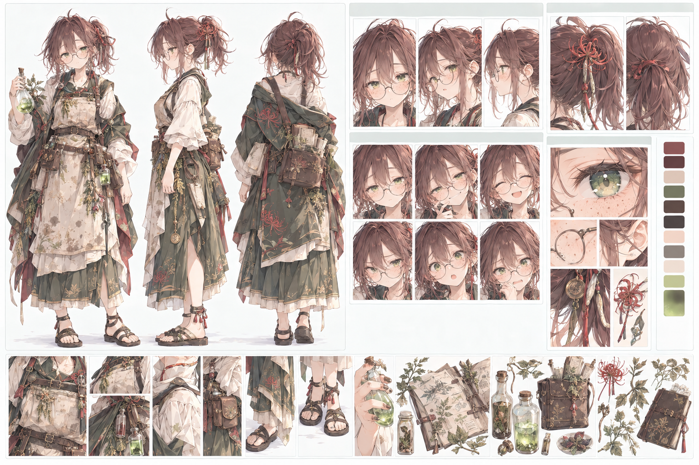
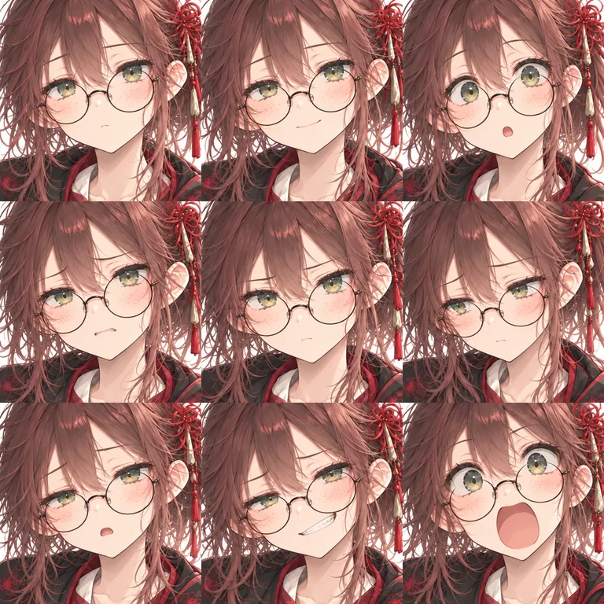

# リコ（リコリス） `lico`

キャラID: `lico` ／ 表示名: リコ ／ 名乗り: リコリス ／ 旧設定名: ポピー（`poppy`）

[キャラクター一覧・設定の扱い](README.md) · [物語・会話の制作指針](../story/story-writing.md) · [世界観：光をためた植物の苦味と加工](../story/world-and-story.md#光をためた植物の苦味と加工制作案)

発光と毒のオタク錬金術師。研究できれば、他のことはどうでもいい。第四章の制作案では、噂の光る苔を塔のそばで増やした悪気のない張本人。

旧設定のポピー（森の錬金術師、採取と調合）を置き換えた人物。名前・性格・外見を作り直し、錬金術師という職業だけを引き継ぐ。旧ポピーの記録は [旧設定ポピーの記録](#旧設定ポピーの記録) にまとめる。

## 人物概要・制作の核

- 18歳くらいの人間の女性。身長は150〜155cmくらいと低めで、小柄だが華奢すぎない。特別な血筋や種族の力を持たず、知識と執着で成果を出す。
- 専門は**発光**と**毒**。光る苔・光る石・光をためる植物の仕組みと、毒草の扱いに詳しい。薬はその応用として作れる。
- 苔は第四章で扱う研究対象の一つ。関心の中心は発光と毒の仕組みで、旅へ出る動機も、土地ごとに違う光る素材や毒を確かめることに置く。苔の収集・栽培だけへ人物像を狭めない。
- 二つの専門を「苦味」がつなぐ。光をためた植物は苦く、毒も苦いことが多い。本人の持論は「苦いものは、光か毒。舐めれば分かる」。
- **一番の実験台は自分自身。** 毒でも光る苔でも、まず自分で触り、嗅ぎ、舐め、飲む。
- 他人に試してもらうときは、必ず同意を取る。ただし頼み方がひどい（「飲んでみて。理論上は大丈夫」）。人に飲ませるのは、自分で飲んで確かめたものだけ。
- 人間との対立では毒で傷つける攻撃を使わず、一時的に動きを止めるしびれ煙を使う。研究を守る足止めであり、相手を実験台にして効果を試す行為にはしない。第四章の効果時間は[ゲーム実装](../gameplay/chapter-four-gameplay.md#リコメリルの対立)を参照。
- 好奇心が倫理や常識より先に立つ。研究が進むなら、誰に利用されても気にせず、自分の行動が周りをどう困らせるかまで考えが及ばない。被害を知ったうえで放置する人物にはしない。気づけば、その後始末へ好奇心を向ける（[第四章での役割](#第四章での役割制作案)）。人を傷つけて楽しむ残酷さや、承知で他人を実験台にする行為も描かない。
- 消えていくもの（抜けていく光、苦味、変わっていく色）を、消える前に確かめずにはいられない。行き過ぎた行動の根は残酷さではなく、この切実さに置く。
- 理屈や研究の話ならいくらでも言えるのに、「ありがとう」「一緒にいたい」のような普段の気持ちは言い出せない。

## 採用済み

ゲームには未登場。プロフィール、会話、加入の実装はない。以下は資料上の制作案であり、ゲーム内の出来事ではない。

## 書くときの手がかり

### 口調

- 一人称は「あたし」。アリア・ミラ・ルナ・ノエルの「私」と書き分ける。
- 普段は眠そうで、言葉が短い。チャチャの語尾を伸ばすおっとりとは違い、口数の少なさでゆるさを出す。
- 得意分野（発光・毒・苦味・装置）の話になると、急に早口のオタクになって止まらない。
- 前触れなく叫ぶ。「あーーっ！」は何かを見つけた合図だが、周りは毎回驚く。
- 呼び方は未設定。レオンは初対面の相手に丁寧語を使う（[レオン](leon.md)）。

### 口癖・台詞の型

以下はすべて未実装の制作例。

| 種類 | 台詞の型 | 使いどころ |
| --- | --- | --- |
| 口癖 | 「……それ、気になる」 | 興味が湧いて調べたくなったとき。そのまま早口の質問攻めへ続く |
| 口癖（違和感） | 「待って。それ、気になる」 | 話の途中で急に黙り、矛盾や違和感に気づく一歩手前 |
| 決め台詞・突っ走るとき | 「消える前に、確かめないと」 | 光や苦味が抜ける前に、周りの制止を振り切る。第四章で実際に対立を動かす執着の言葉 |
| 人に頼むとき | 「飲んでみて。理論上は大丈夫」 | 同意は取るが、安心させる言い方ができない |
| 寄り道の言い訳 | 「夕暮れまで、時間はまだあるでしょ」 | 予定を無視して寄り道・裏道へ入る |
| 決め台詞・引き受けるとき | 「次は、あたしが確かめる」 | 他人の記録・試料・発見を受け取り、自分の仕事として引き受ける。礼や意気込みを研究の言葉で返す |
| 判断を待たせる型 | 「まだ、比べてない」 | 分かったことにされるのを嫌がる。物・記録・味などへ使えるが、必要な手当てを拒む万能の口実にはしない |

自分が先に飲んで確かめてから他人に勧める線引きは、人物の行動として維持する。決め台詞を飲用場面へ限定しない。「消える前に、確かめないと」と「次は、あたしが確かめる」は、執着が対立にも協力にも向く同じ人物の言葉として使う。第四章で性格が治った合図にはしない。

「それ、気になる」は違和感の入口を示すだけに留める。証拠とつなげて答えを出すのはアリアやレオン、地域の人に任せ、リコを全部解く役にしない。住民や主人公の観察を奪わない。

### 行き過ぎるところ

| 長所 | 短所 |
| --- | --- |
| 光や毒の仕組みを、手で確かめた実感とともに知っている | 危険な物でも、まず自分の口で確かめる |
| 誰も気に留めない違和感に「それ、気になる」と引っかかる | 気になった瞬間、予定も会話も放り出す |
| 精巧な装置（蒸留器など）を自作できる | 研究が進むなら誰に利用されても気にせず、周りが困ることまで考えが及ばない |
| 裏道や近道に詳しい | 決めた道順を無視して、夕暮れまでまだあると寄り道する |

- 理屈の人なのに、実験の前には必ずおまじないをする。「効かないよ。でもやらないと落ち着かない」。
- 実験のあとのご褒美は自作の薬草ソーダ。苦くて甘くて、しゅわしゅわする。
- 味覚が独特で、薬くさい味や苦い味が好き。メリルが食欲で何でも食べるのに対し、リコは確かめるために舐め、ついでにおいしいと思う。
- 第二章以後の人物と同じく、倫理観の獲得や欠点の克服を目標にしない。被害を知っても急に反省するのではなく、好奇心の向きが変わるだけにする。

## 外見・衣装・武器

### リファレンスシート

ユーザー提供のリファレンスシートを基に、2026-09-25の指定で衣装を赤・黒基調へ更新した。全身の正面・側面・背面、顔の角度と表情、髪・瞳・衣装・手元・小物の拡大図、色見本を収める。配色更新後の1536×1024pxのPNGをロスレスWebPで保存した。顔立ち、そばかす、丸眼鏡、髪型、衣装の形は維持する。[配色更新の生成記録](../art-generation/lico-red-black-generation.json)を参照する。

人物設定と表情の意図は、本資料に反映したユーザーの指定文を正とする。シートの整った顔や明るい笑顔だけを強めず、下記の素朴さと癖を保つ。

### 体格・顔・表情

- 小柄で、華奢すぎず、素朴で親しみやすい若い女性。「かわいく整いすぎた美少女」にせず、やわらかく作り込みすぎない自然な顔立ちにする。美しさより、親しみやすさ・癖・印象の残り方を大事にする。
- そばかすはやや多め。丸メガネはずり落ち気味で、瞳は発光植物を思わせる黄緑〜淡い苔色。目元は少し眠たげでもよいが、寝不足感は強調しすぎない。
- 普段はぼんやり、静かめ。興味をひかれたときや薬を手にしたときには、**「変で癖がある笑み」**になる。少し口の端だけが上がり、ちょっと怪しく、初対面だと少し引かれるが、見ていると妙に癖になる笑み。
- 悪人らしさや不気味さを強めず、「変わってるけど魅力がある」範囲に収める。危ない研究者でも、残酷さより発光と毒への好奇心が先に見えるようにする。

### 髪型・衣装

- 髪は赤みのある暗い茶色〜くすんだ赤紫。短めのポニーテールを低め〜中くらいの位置で軽く結び、寝癖・後れ毛・跳ねた毛を残す。身なりには無頓着で、きっちり整えない。
- 彼岸花を思わせる赤い髪飾り・結び紐・衣装の意匠を自然なアクセントにする。モチーフを増やしすぎて華美にしない。
- 素朴でラフな薬草・錬金術師の服に、**深紅の作業用の前掛け（エプロン）**を着ける。上着とスカートは炭黒、裏地・紐・彼岸花の刺繍は赤。生成りのブラウスと裾は補助色として残す。野外採取と簡単な調薬の両方に合う実用的な装い。前掛けは多少の使用感に留め、薬のしみや汚れを強調しすぎない。
- 野外でもサンダル。露出は抑え、派手な高級感や貴族らしさは出さない。
- 薬草・植物・毒・発光素材を扱う化学／植物系の錬金術師として描く。蒸留器などを自作できる設定は保つが、ゴーグル・重機械・背負う蒸留器を主役にした工学・機械技師の外見へ寄せない。

### 小物・手元・配色

- 小さな薬瓶・試薬瓶、植物片・植物標本、採取ノート、採取道具、薬草ポーチを優先する。機械工具より、発光する薬液や植物素材が似合う手元にする。
- 薬草や薬剤をよく触る指先は少し乾いて荒れている。荒れを誇張しすぎない。
- イメージカラーと衣装の基調は**赤・黒**。深紅の前掛けと炭黒の上着・スカートを大きな色面にし、赤い彼岸花の意匠を重ねる。生成りはブラウスなどの補助色、革小物は黒に近い焦げ茶。衣装を緑や生成り主体へ戻さない。黄緑は瞳と発光する薬液・素材の小さな差し色に使う。自然な染め布の落ち着きを保ち、派手なネオン感や貴族風の豪華さは出さない。
- 専用武器は未設定。採取・研究の小物を、そのまま確定した武器として扱わない。戦いでは発光試料を使って相手の動きを妨げ、採取と調査を支える。

### 顔アイコン

会話用の顔のアップ。上段は通常・笑顔・驚き、中段は困り・真剣・照れ、下段は疲れ・怪しい笑み・叫び。そばかす、黄緑〜淡い苔色の瞳、ずり落ち気味の丸メガネを全コマで揃える。メガネは横長の楕円にせず、縦横がほぼ等しい円形の細いフレームにする。

怪しい笑み `mischievous` は、興味をひかれたときに片側の口の端が上がる癖のある笑み。叫び `shouting` は、発見の瞬間に「あーーっ！」と急に声を上げ、目を見開き、大きく口を開ける顔。普通の驚き `surprised` と区別し、怒りや恐怖の叫びにはしない。文字は画像に入れず、台詞側で指定する。

768×768px、3列×3行、1コマ256px角のWebP（品質82）。共通の `Portrait` と `expressionPortrait` からキャラID `lico` と表情を指定して使う。襟元と肩の衣装も赤・黒に揃える。制作条件と丸メガネへの修正プロンプトは [初回の生成記録](../art-generation/lico-expressions-generation.json)、2026-09-25の衣装色更新は [配色更新の生成記録](../art-generation/lico-red-black-generation.json) を参照する。

## 関係性・関連する人物

以下は制作案。

- [アリア](aria.md)：光るものに目を輝かせる者どうしで意気投合する。アリアは見つけたものを人と分けたがり、リコはまず自分で確かめたがる。
- [レオン](leon.md)：決めた道順を無視されて振り回される。サンダルの足元を心配する。装置の精巧さは本気で認める。
- [ミラ](mira.md)：荒れた指に軟膏を塗ろうとし、「試料に混ざるから」と逃げられる。自分を後回しにする者どうしだが、ミラは人のため、リコは好奇心のため。ミラが本気で叱る相手になる。
- [フィン](finn.md)：裏道仲間。「その薬、高く売れるねえ」「売らないよ、まだ量が分からないから」。
- [メリル](merrill.md)：何でも飲んでくれる理想の実験台。ただし感想が「おいしい」だけで、記録の役に立たない。
- [ルナ](luna.md)：研究者どうし。ルナは星と観測から仕組みを考え、リコは物に触れて味や反応で確かめる。調べ方の違いで書き分ける。
- [マッドハロウィン](../factions/mad-halloween.md)の一員ではない。「マッド」な研究者でも、メリルたちの組織とは関係を持たせない。

[関係性の一覧と既存の掛け合い](../relationships/README.md) も確認する。関係性の共通本文はここへ複製しない。

## 人物を深める軸・制作案

### 第四章での役割（制作案）

場面構成は [第四章計画](../story/story-part-4.md) を正とする。以下は人物側から見た役割。

- 第一章の塔が直った話を噂で聞き、「光る苔が塔の力を吸う」ことに夢中になる。噂の伝播から栽培開始の順序は [人工栽培問題の時間関係](../story/world-and-story.md#人工栽培問題を採用する場合の時間関係) に従う。主人公たちの成功が次の事件のきっかけになる。
- 研究のため、塔のそばで苔を増やした張本人。本人は増やして調べたいだけで、悪気はない。
- 商人がその苔を買い取り、抜ける前に加工して儲けている。リコは研究費と苔の置き場があれば、誰に利用されてもかまわない。
- 苔床を移そうとする四人と、証拠を見るまでは「あと三日で記録が揃う」と戦う。被害を知りながら放置するのではなく、まだ納得していない状態として描く。
- 納得した後は、移し替える苗を食べに来たメリルから「それは渡さない」と守り、初めて四人の側で戦う。旅団を結成するのは章末。
- 塔が暗くなると街道の人が困る、というところまで考えが及んでいなかった。自分の記録と管理人の記録を見比べて被害を知っても急に反省はせず、「……それ、気になる」と直し方へ好奇心が向き、後始末に本気で取りかかる。
- 被害を知ったうえで利益を取った商人とは、ここで判断を分ける。
- 移した苔床はブレッカに残す。リンデへ行って戻る最初の予定と、留守中の水の世話・日々の記録を管理人と作業地の人に引き継いでから出る。旅の合間に戻って観察と手入れをし、遠出の前には戻る時期と留守の管理を相談する。無人で放置する研究地や、リンデへ移転した研究室として扱わない。
- 塔のそばで勝手に研究することはできなくなる。旅団と一緒なら、管理人の許しを得て各地の塔の不思議に近づける。本人は「研究のため」としか言わず、その先の気持ちは言い出せない。

### 仲間になった後の役割（制作案）

- 冒険では、発光する素材や毒のあるものへ興味を向け、性質を確かめる。アリアは野外で見つけて摘む人、リコはその光り方や毒の働きを調べ、加工する人として分ける。
- 拠点では調薬と装置作りを担う。光が抜ける前に加工すれば味や薬効が残るという世界の性質を、冒険で摘んだ物を拠点で加工する流れにつなげられる。薬草ソーダが旅団の定番の飲み物になる、といった暮らしの要素も候補。
- 現在のゲームには拠点・消耗品・調薬の仕組みがない。物語上の役割として先に置き、ゲームの機能は [旅団の拠点機能（設計案）](../gameplay/guild-base.md) で設計する。菜園の世話係と作業台の加工担当で、リコを得意な人にする案。

## 未設定

出身地、専用武器、家族、錬金術を学んだ経緯、仲間の呼び方。空欄を埋めるためだけに重い過去や秘密を追加しない。[共通の未設定事項](README.md#共通の未設定事項) も参照する。

## 名前の由来（制作メモ）

ユーザーの好きなスピッツの曲「リコリス」から取った。ゲーム内で曲名や歌詞を引用しない。人物像には、曲から受け取った次のイメージを使う。

- 旅の話を読み、突然現れる人。外れた口笛。好き嫌いの分かれる「リコリス味」の笑顔。
- 眠そうな目と、乾いて荒れた指。触れることから確かめ始め、輝くものを追いかける。
- よくできた装置と、おまじない。冷たい炭酸を飲み干す。裏道を歩き、夕暮れまでまだあると寄り道する。
- 言い出せないまま、消えてしまう前に、という切実さ。

「リコリス」という語は、苦い薬を飲みやすくする甘草（licorice）と、毒のある球根を持つ彼岸花（Lycoris）の両方を指す。甘さと毒を同じ名前に持つことを、発光と毒の研究者という人物像に重ねる。

## 旧設定ポピーの記録

リコは旧設定のポピーを置き換えた人物。以下は過去の設定と画像の記録で、リコの設定ではない。

- 旧ポピーは「森の錬金術師。採取と調合が得意」。失敗した薬も「新しい味」と言い張る、調合や薬草園の世話に夢中になる、アリアとは森の恵みを分け合う、という設定だった。
- 会話画面の顔アイコン枠に旧ポピーの画像が残る（[会話画像](../art/prologue-dialogue-art.md)）。
- メリルが苦みを抜く前の胃薬を飲んでしまう場面は、リコで描き直す場合も使えるネタ。旧ポピーの慌てる反応はリコの性格と合わない。リコなら飲んだ感想をすぐ記録しようとする。

## 関連資料・実装

プロフィール・会話・加入の実装はない。[苔の設定](../story/world-and-story.md#淡光苔制作上の仮称) と [光をためた植物の苦味と加工](../story/world-and-story.md#光をためた植物の苦味と加工制作案) を人物の専門分野の前提とする。資料整理だけでゲームやセーブの内容は変わらない。
