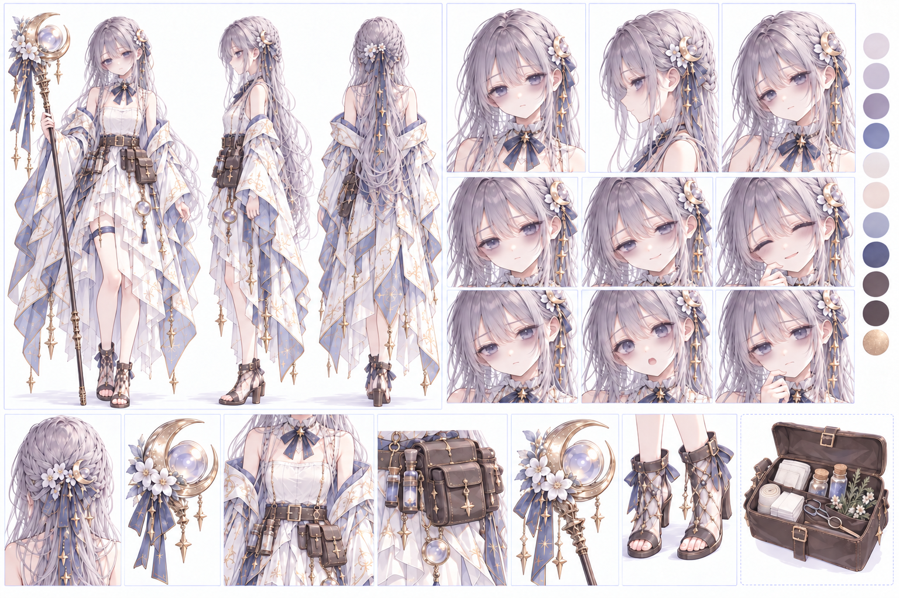

# ミラ `mira`

キャラID: `mira`

[キャラクター一覧・設定の扱い](README.md) · [物語・会話の制作指針](../story-writing.md)

月詠みの治癒師。護衛と回復を担う。

## 採用済み

- 穏やかな旅団のお姉さん。お茶には強いこだわりがある。
- フィンにはお説教もするが、お茶の時間も用意する。
- ガルとは、荷物と元気をそれぞれ守る関係。
- アリアとレオンに小さなテーブルとふたつのカップを用意し、言い立てずに席を外す。

## 書くときの手がかり

やわらかい「〜ね」「〜わ」や、落ち着いた提案が似合う。相手の返事を待てる人物。ふたりの恋心を解説する語り手にはしない。

### 口癖・決め台詞・構文

| 種類 | 台詞の型 | 使いどころ |
| --- | --- | --- |
| 普段の口癖 | 「その前に、ひとつだけ」 | 出発や休憩の直前にも、誰かの手当てを始める |
| 献身の口癖 | 「あと一人だけ」 | 診る相手が増えるたび、休む時刻が延びる |
| 自分への言い訳 | 「私は、まだ大丈夫よ」 | 他人なら休ませる不調を、自分には許してしまう |
| 得意な構文 | 「〇〇〇を、△△△を」 | 二つの句をそれぞれ「〜を」で言い切る。役割を並べたり、祝福とお仕置きのように対比させたりする |
| 治癒師としての決め台詞 | 「痛いのは、我慢しなくていいのよ」 | 小さな傷を隠す相手にも、戦闘で傷ついた仲間にも |
| お茶へのこだわり | 「急いでいても、ここは待ちましょう」 | 自分の休息は削るのに、蒸らす時間は削らない |

得意な構文は、動詞を省いて「〜を」で言い切る形を二度重ねる。二つの内容が同列、または対比になっていると、よりミラらしい。普段の会話でも繰り返し使い、すべての台詞へ機械的に当てはめない。

ゲーム内の台詞例（合意済み・実装済み）：

- 「私は治療を、貴方は前を」：2-6出発前、レオンへ（`begging-golem-departure`、[会話実装](../../lib/chapter-two-delivery-stories.ts)）。
- 「よいこには祝福を、わるいこにはお仕置きを」：2-7出発前、薬を返さないプティへ（`sweet-blockade-departure`、[会話実装](../../lib/chapter-two-finale-stories.ts)）。

穏やかな口調のまま、気づくとミラが仕事を引き受けている。その繰り返しで人物像を作る。決め台詞を回復時に使うのも候補。相手には我慢をさせず、自分の不調は後回しにする食い違いを保つ。場面ごとの台詞と、アリアが構文を返して休ませる場面は [第二章計画](../story-part-2.md) に置く。第二章の手当て・役割分担・プティとの対峙、待機中の掛け合い、ガルとの連携台詞へ適用済み。

## 人物を深める軸

人の世話は上手だが自分の疲れは隠す。フィンが気づき、いたずらめいた理由をつけて休ませる場面は将来の候補。見守る側のミラも仲間から世話をされてよいが、これを第二章で自己犠牲を克服する筋にはしない。

一人称は「私」。

## 第二章の制作の核：自分を患者の数に入れない

過剰な献身・自己犠牲を強め、無難な世話役にしない。以下は [第二章計画](../story-part-2.md) のための人物設定。実装状況は [第二章のゲーム実装](../chapter-two-gameplay.md#実装状況) を参照する。

- 他人の顔色や小さな傷にすぐ気づくが、自分の不調は「まだ動ける」で済ませる。他人へは食事と休息を勧め、自分はその間に次の薬を作る。
- 「あと一人だけ」が、患者に会うたびに更新される。助けてもらうこと自体を拒むとは限らず、空いた時間をさらに誰かの世話へ回してしまう。
- 穏やかで話が通じるのに、休ませようとすると手ごわい。献身を褒めるだけで済ませず、実際に倒れる、配達の段取りが変わるなどの困りごとも描く。
- お茶への強いこだわりは残す。ふらふらでも蒸らす時間は省略しないなど、性格の偏りと本人らしいおかしさを同じ場面に置ける。
- 二度目の出会いとなる街の薬草依頼の納品時に、報酬と二人への傷薬を用意し終えて過労で倒れる。
- その後もたびたび倒れる、往診後に寝落ちする、休ませたはずなのに別の患者のところへ行っている、などの形で癖を繰り返す。毎回運ばれるだけの同じ場面にしない。
- 第二章末でも過剰な献身は治らない。仲間になったことで行動範囲と世話を焼く相手が増える余地を残す。倒れる描写を戦闘時の強制離脱・HP仕様として自動実装しない。

第二章では2-2の納品時に倒れ、2-3で十分な休養を取ったあと正式加入する。2-4から三人旅を体験し、2-8の往診後には椅子で眠ってしまう。具体的な台詞・進行は [第二章計画](../story-part-2.md) を正とする。既存の加入エピソードは参照素材であり、今回の出来事として流用したことにはしない。

## 現行の加入エピソード

[従来モード](../gameplay.md#従来モードの扱い)にある記録で、ここへ新しい場面を足さない。新しい物語でのミラの正は第二章（2-2の出会い、2-3の加入）であり、以下は加入理由・順序の確定事項ではない。条件・進行は [仲間加入](../recruitment.md) を参照する。

- 出会いで見える事情：山の患者への往診をひとりで続け、自分の休息を後回しにする
- 準備中に分かる一面：集めに行く仲間の傷薬は用意するのに、自分の分を忘れがち
- 加入を選ぶ理由：帰り道と休む席まで用意してくれる人たちと、薬を作りたい

## 関係性・関連する人物

[フィン](finn.md)、[ガル](garr.md)、[チャチャ](chacha.md)。

[関係性の一覧と既存の掛け合い](../relationships/README.md) も確認する。関係性の共通本文はここへ複製しない。

## 制作案・未設定の確認先

[塔の物語で人物を動かす軸](README.md#塔の物語で人物を動かす軸) と [共通の未設定事項](README.md#共通の未設定事項) を参照する。第一部の二人以外の登場・加入案は第二部以後として扱う。

## 外見・関連資料・実装

### リファレンスシート

GPT Imageで作成した外見・衣装の制作参考。薄紫の髪、儚げで疲労をにじませながら頑張る表情、治癒師らしい軽いローブ、治療用の薬や道具を収めるウエストポーチ、月のモチーフを主な方向性として扱う。

重い上まぶた、目の下の柔らかな灰紫の影、血色の薄さを土台にし、疲れていても患者に向ける優しい目と微笑みを残す。普段にも疲れがにじむが、寝不足の強い場面では目元の影とまぶたの重さを強める。喜び・驚き・真剣さは描き分け、どの表情も眠そうな同じ顔にはしない。肩の見えるローブ、髪飾り、薬のポーチなどの衣装設定は維持する。

会話・キャラクター画面の顔アイコンは、この目元を基準にした [8表情](../../public/portraits/mira-expressions.webp) を使用する。制作条件は [シートの制作条件](mira-reference-sheet-generation.json) と [会話の表情](../dialogue-expressions.md) を参照。

シート内に自動生成された年齢・身長・台詞などの文字情報は、確定設定として扱わない。人物設定の正本は本ファイルと関連資料を優先する。

冒険画面は、このシートを参照した `public/animations/mira-v1.png` を使用する。髪飾り、月の杖、軽いローブとウエストポーチを反映し、歩行・攻撃・回復・待機・被弾の動作を描き分けている。会話の表情画像や既存スチルとは別の素材で、制作条件は [動作画像の制作記録](../hero-animation-art.md) を参照。

[プロフィール・既存ペア](../../lib/roster.ts)、[物語・道中の掛け合い](../../lib/stories.ts)、[拠点の暮らし](../../app/guild-home.tsx) をキャラIDで確認する。外見の追加設定は既存の画像・制作記録を確認してから行う。

数値・加入条件・表示条件の最終的な正は [現在のゲーム](../../lib/game.ts) と各シーンの実装。資料整理だけでゲームやセーブの内容は変わらない。
