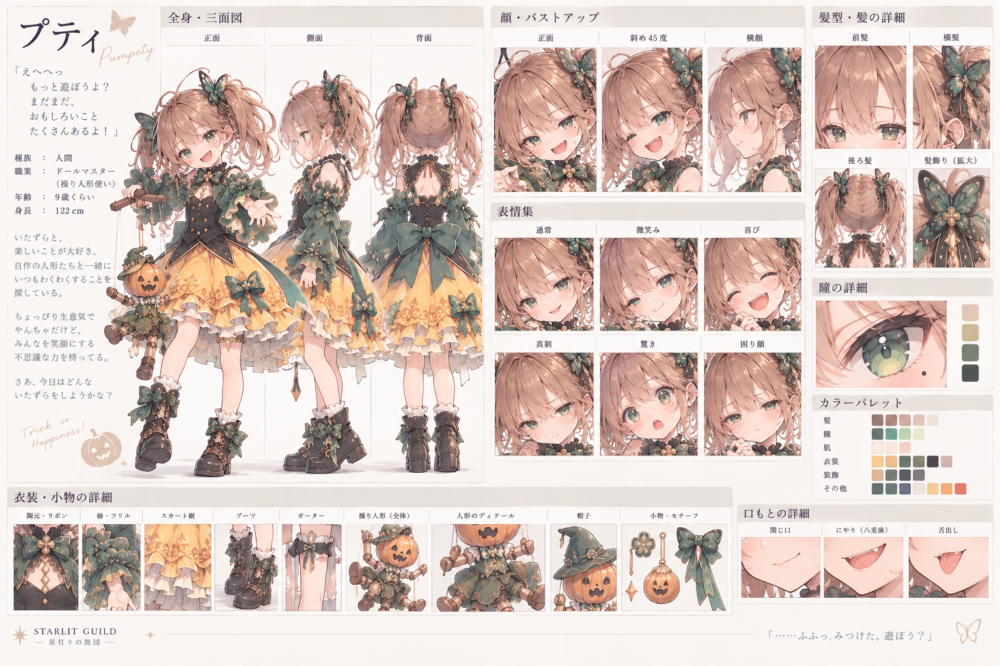

# パンプティ（プティ） `pumpety`

キャラID: `pumpety` ／ 愛称・一人称: プティ

[キャラクター一覧・設定の扱い](README.md) · [物語・会話の制作指針](../story-writing.md)

## 制作の核・書くときの手がかり

- 八重歯と茶色いツインテール、青緑の目。衣装は `502328_e13571_pinup.jpg` を優先し、黒い身頃、緑の袖と飾り、黄色いスカート。ドワーフの血を引き、夜目がきく少女。
- いたずら好きのトリックスターで、人形を武器に操るドールマスター。愛称はプティ。一人称にも「プティ」を使う。朗らかな受け答えのまま、相手の予想を一段ずらす。
- 語尾には「〜なのよ」「〜のよ」を多用する。人形を通した声にも同じ口調を混ぜる。第二章の合意済み方針で、従来記録の台詞を変更済みという意味ではない。
- 表情は無邪気な笑顔だけでなく、八重歯をのぞかせたニヤリ顔、企みが成功しそうな得意顔など、「次のいたずらを考えている」と伝わるいたずらっ子らしい顔を基調にする。スチルでは相手を驚かせようとする手つきや身振りも積極的に使う。
- マッドハロウィンの一員。暗闇、人形、道標のすり替えを使う敵役。謝罪させるのはまず人形で、自分にも頭を下げるよう指摘される。

## 第二章の制作の核：甘いものを奪う山賊騒ぎ

[第二章](../story-part-2.md) の山道に敵役として登場し、小さな人形とゴーレムを人形として使役する。2-5・2-6は実装済み。2-7以降は制作設定。

- 小さな人形・大きな人形のどちらの遭遇も、第一声は「Trick or Treat！　お菓子をくれなきゃ、いたずらしちゃうよ！」。甘いものを根こそぎ要求する狙いを、人形ごとの取り分を増やす理屈で見せる。「山賊にしては小さい」「山賊にしては大きい」という証言を、異なる人形の目撃で両立させる。
- プティにとって人形は役者。大きなゴーレムにも、お辞儀やおねだりなど芝居がかった仕草をさせる。ゴーレムの由来・仕組みは [世界観](../world-and-story.md#第二章で見せる自然と道具制作案) の制作案を参照する。
- 2-5では道標を取り戻される間に、別の人形が休憩用の菓子を少し盗む。2-6では「あれは小さい子のぶんなのよ。こっちの子、まだもらってないのよ」とゴーレムの取り分を要求し、薬用の蜜を奪う。蜜を届ける相手は病気の子たちで、ミラがその用途を明言する。台詞全文と進行は [第二章計画](../story-part-2.md) を正とする。
- 第二章はパンプキンヘッドをかぶって登場する。頭は外さず、穴の内側も暗くして素顔や目元は見せない。頭の傾き・手の動き・人形の仕草で企みを表す。大小の人形にはカボチャ、コウモリ、黒・緑・黄色の布や飾り紐など、本人が施したハロウィン風の装飾を付ける。普段の素顔の設定は維持し、この章の会話画像・一枚絵では頭を外さない。
- 自己紹介はしないが、一人称の「プティ」で名前が漏れる。2-6の声で漏れる。2-6の一枚絵では大小の人形の少し後ろに、小柄なパンプキンヘッド姿で操る様子を見せ、2-7で正面から対峙する。主人公たちは名前を問い返したり、この時点で名前呼びしたりせず、謝罪を促すときも「あなたも」と言う。章末まで素顔の披露や親しい呼び方へ進めない。
- 通行妨害を止めても、いたずら好きやずるい理屈は直らない。謝罪を人形にさせる癖も使える。倒して退場する大悪党にも、仲間として加入する人物にも変えない。

## 採用済み

- 採用済み：`midnight-snack` の帰還、`puppet-midnight` の出発・帰還。人形は彼女の役者であり、メリルのおやつにはしない。加入はしない。

## 関係性・関連する人物

[メリル](merrill.md)、[フィン](finn.md)、[マッドハロウィン](../factions/mad-halloween.md)。

[関係性の一覧と既存の掛け合い](../relationships/README.md) も確認する。関係性の共通本文はここへ複製しない。

## 制作案・未設定の確認先

[塔の物語で人物を動かす軸](README.md#塔の物語で人物を動かす軸) と [共通の未設定事項](README.md#共通の未設定事項) を参照する。第一部の二人以外の登場・加入案は第二部以後として扱う。

## 外見・関連資料・実装

### リファレンスシート

GPT Imageで作成した外見・衣装・人形の制作参考。茶色のツインテール、青緑の目と八重歯、黒・緑・黄色を基調にした衣装、蝶とカボチャの意匠、操り人形を主な方向性として扱う。

シート内に自動生成された年齢・身長・職業・台詞などの文字情報は、確定設定として扱わない。人物設定の正本は本ファイルと関連資料を優先する。

[プロフィール](../../lib/original-characters.ts)、[画像制作記録](../original-character-art.md)、[採用画像](../original-character-gallery.md)、[仲間と来客の会話](../../lib/character-encounters.ts)、[スチルの対応](../../lib/story-art.ts) を参照する。

初遭遇・クエストの会話は [マッドハロウィンの物語](../../lib/mad-halloween-stories.ts) を確認する。

数値・加入条件・表示条件の最終的な正は [現在のゲーム](../../lib/game.ts) と各シーンの実装。資料整理だけでゲームやセーブの内容は変わらない。
