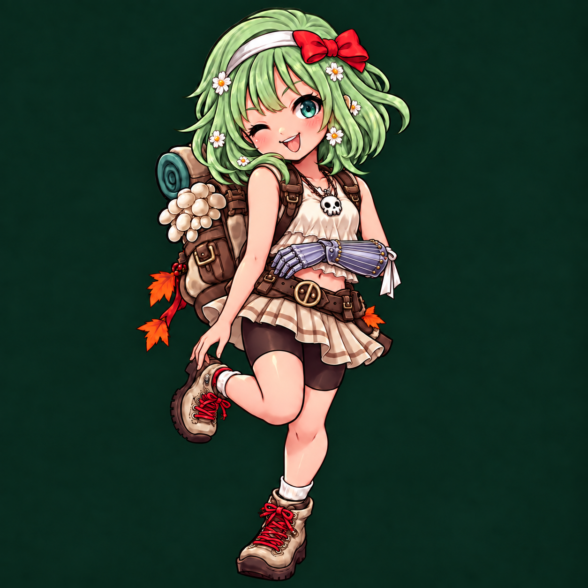
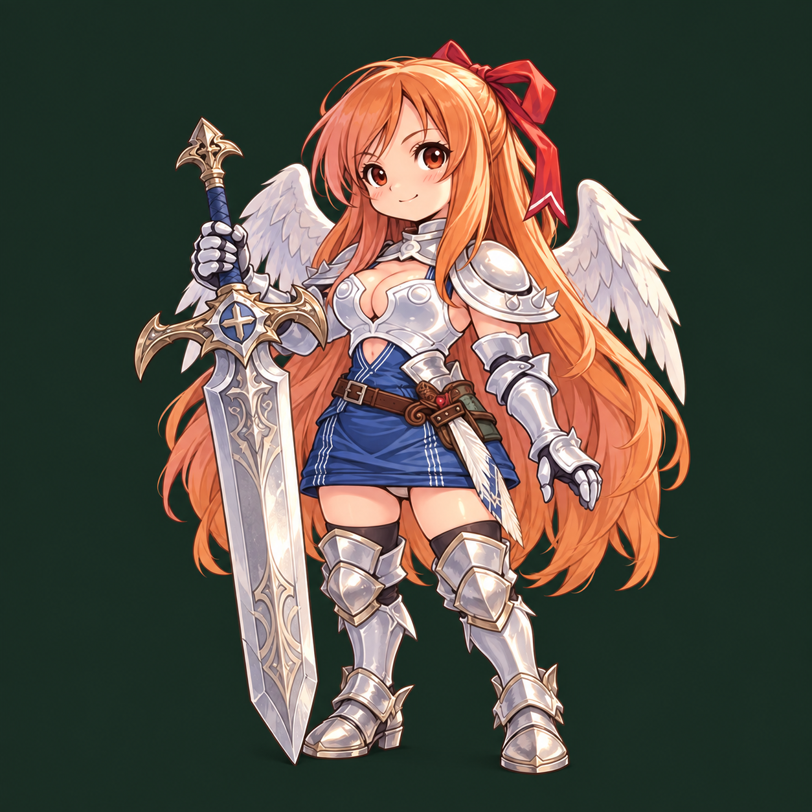
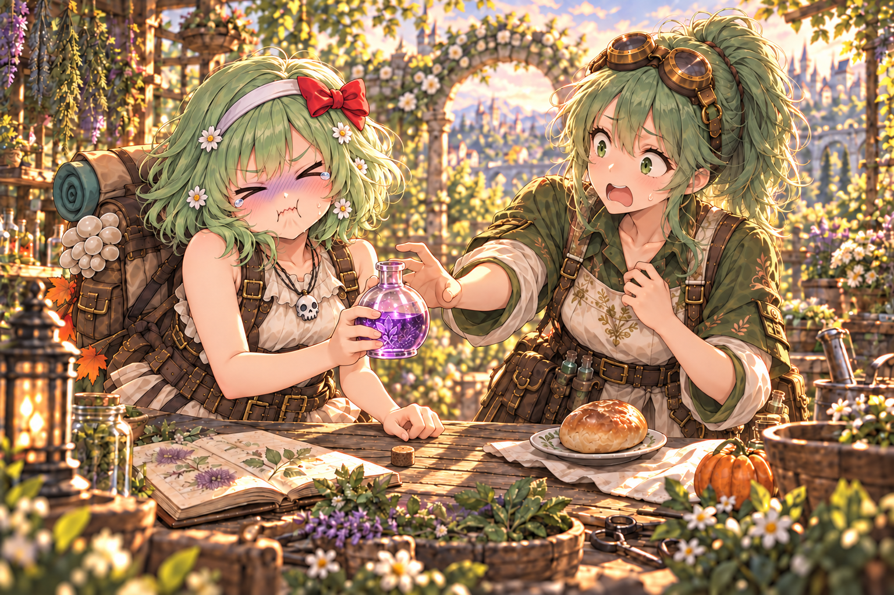
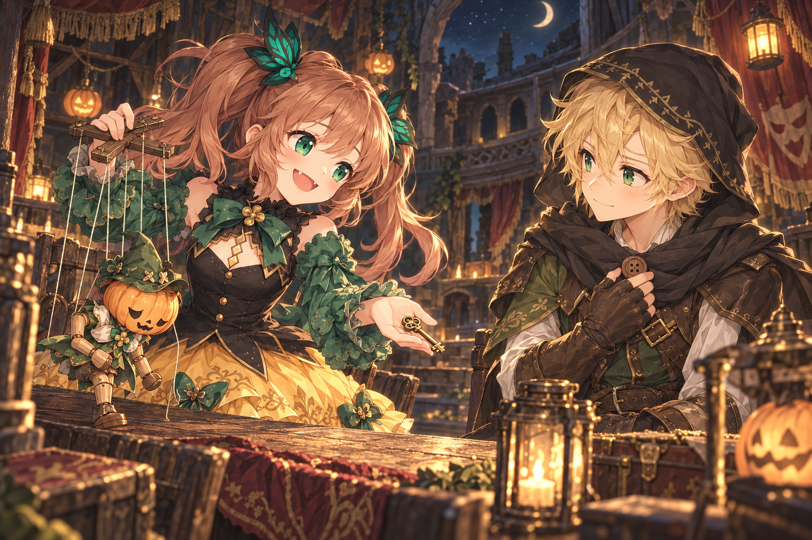
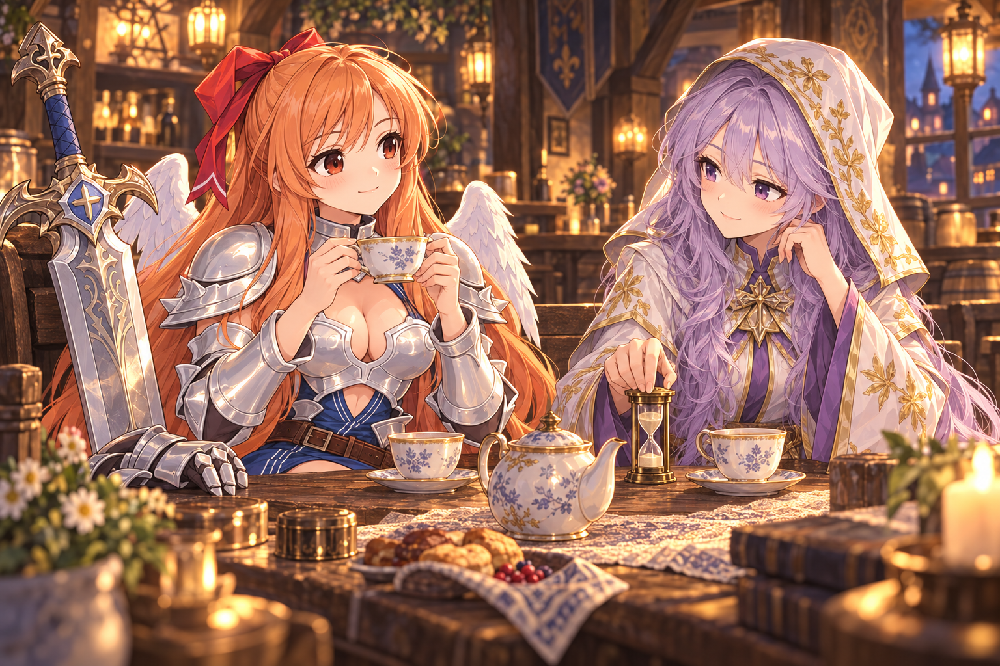

# オリジナルキャラクターと新しい思い出

指定された参考絵に合わせて修正した立ち絵3枚と、既存の仲間とのスチル3枚。
制作方法は組み込み image_gen。[メリルの自然なポーズとギャグスチルの修正記録](merrill-relaxed-gag-prompts.json)・[最終プロンプトと参照画像](original-character-art-v2-prompts.json)・[制作記録](original-character-art.md)。

## メリル

`a10777_zen_2.jpg` の装具を優先。本人の左腕だけに装備し、手の甲側から全指の指先まで覆うガントレットそのものが琴。手のひらと指の腹は開け、弦は前腕の甲側にだけ張られる。右手は素手。立ち絵は演奏せず、左腕と手首を自然に保つポーズ。

## チャチャ

`a26705_bust_2.jpg` を優先。筋肉の輪郭を抑えた柔らかな体つき、銀の鎧と青い服。大剣を振るう力持ちと、おっとりした性格はそのまま。

## パンプティ（プティ）

`502328_e13571_pinup.jpg` を優先。黒い身頃、緑の袖、黄色いスカート。ツインテールと八重歯、人形遣いの道具。

## メリル × ポピー「試飲役には向かない」

もう飲んでしまったメリルは、苦さに涙目。ポピーは「それ、大丈夫なの！？」と大慌て。籠手を外した素手で瓶を持つ、飲んだ直後のギャグ場面。

## プティ × フィン「返さない宝物」

盗んだ鍵は返す。でも、遊びに使ってはいけない宝物もある。人形が頭を下げ、フィンは古い木のボタンを胸元にしまう。

## チャチャ × ミラ「三分を数える手」

蒸らし時間は、筋トレの回数では計れない。大剣を置き、ふたりで座ってお茶を待つ。

ガルとの会話「重さより、持ちやすさ」も追加。お盆の持ち手を直す細かな仕事と、大剣を支える力を持ち寄る。

## ゲームで読むには

「思い出 → 仲間と来客」。当人の加入と設備が必要。メリル、プティの来訪は、それぞれの敵役クエストを一度達成すると開く。スチルは対応する動作のページから現れ、読了後は鑑賞一覧に残る。
