# シナリオスチル一覧

スチルの制作確認用一覧。ゲームではそれぞれの物語の該当ページから表示します。
場面と表示条件は [制作記録](story-art.md)、組み込み image_gen に渡したプロンプト原文は [生成記録](story-art-generation.json) に保存しています。

## 水の通る音

第一部1-8。復旧した水路をアリアが指し、レオンが隣から覗く。塔の灯りが戻り始める行から表示する。[制作記録](stage-1-7-1-8-art.md)を参照。

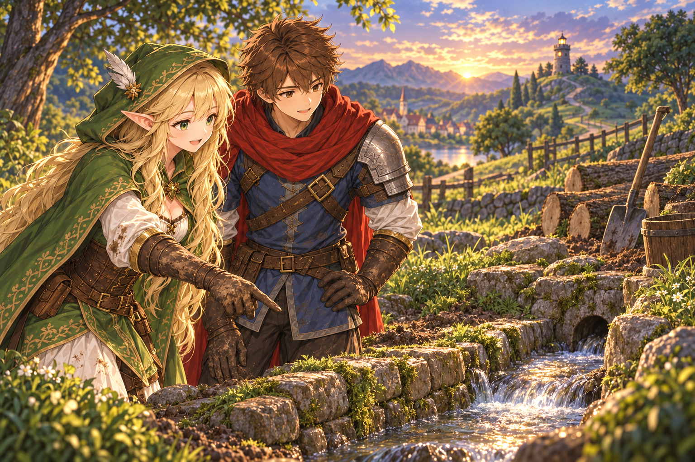

## 同じかもしれない

第一部1-6。採用案「C改」。肩幅を狭めたアリアを正面寄りの胸上で描く油彩調の一枚絵。顔・表情を主役にし、両手の器を顎の近くまで持ち上げて二つの苔を見比べる。持ち上げる行から表示し、まだ同種とも塔の不調の原因とも断定しない。[背景の制作記録](stage-1-6-art.json) と [生成プロンプト](stage-1-6-closeup-art.json) を参照。

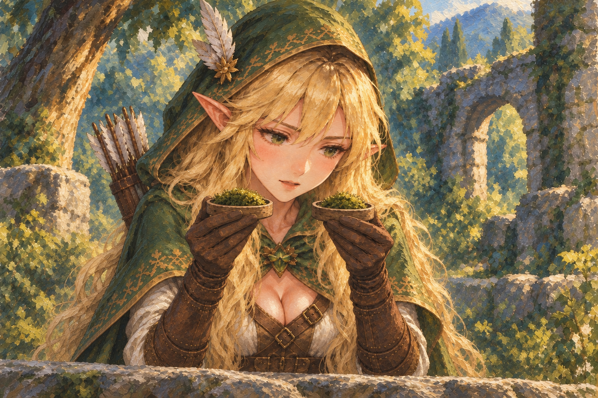

## 石陰の拾いもの

第一部1-4。管理人の許可を得て分けた光る苔が、小さな木の入れ物で手元を照らす。この絵の生成プロンプトと背景・苔灯の記録は [制作記録](story-art.md#第一部1-41-52026-09-13) を参照。

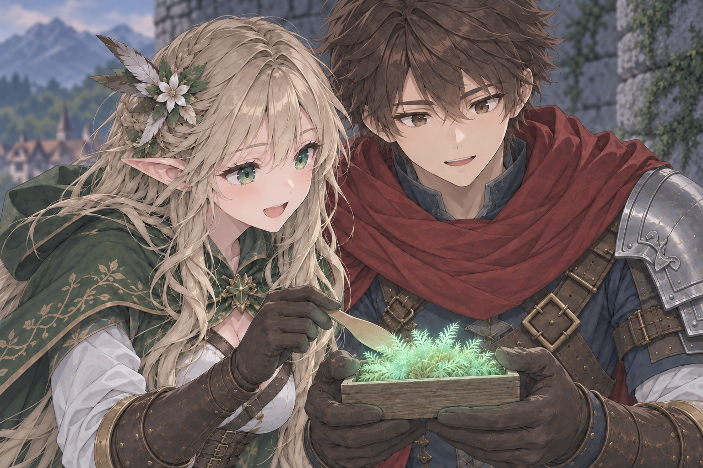

## 青い灯りの届く距離

洞窟の入り口。レオンがランタンをふたりの真ん中へ持ち直す。

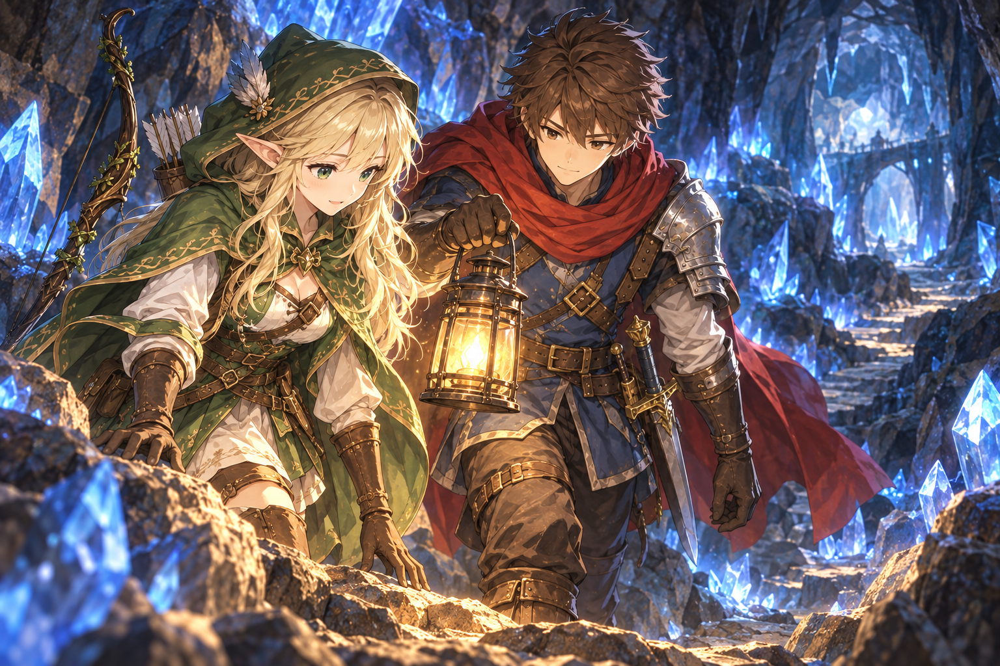

## ほつれた言い訳

アリアが袖を繕い、レオンが手元を見守る。

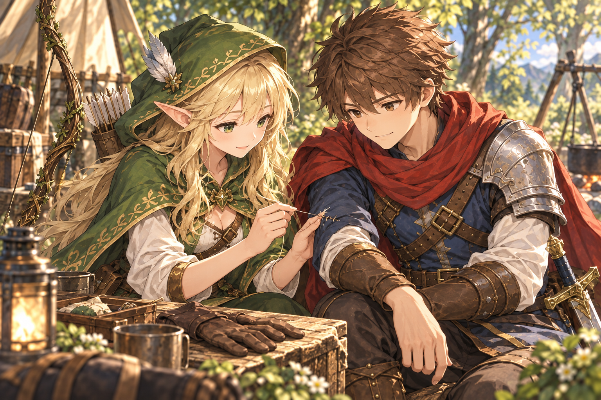

## 押し花の行き先

落ちていた花びらを手帳にはさみ、来年もこの森へ来る話をする。

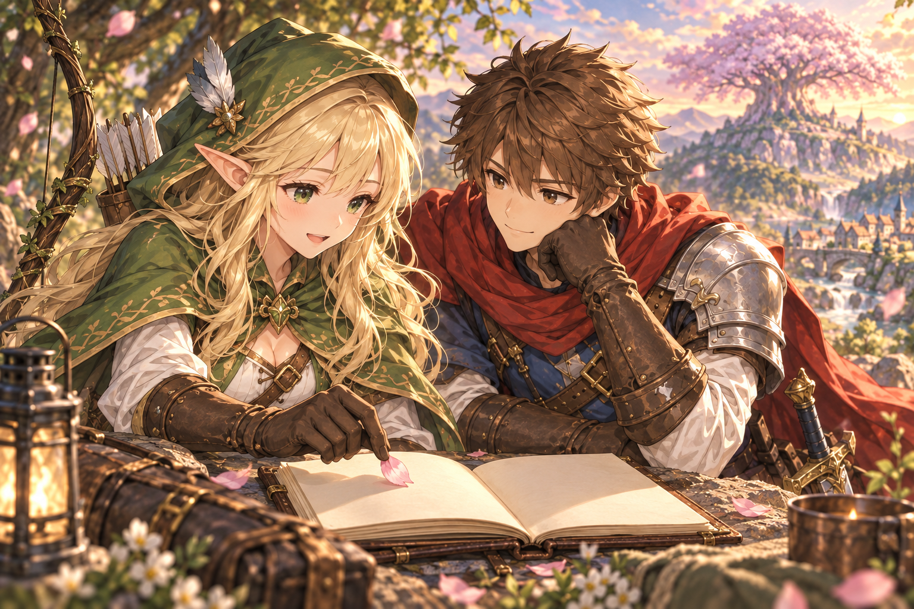

## 護衛のあとの約束

仕事を終えたふたり。アリアが半歩近づき、祭りの灯りへ誘う。

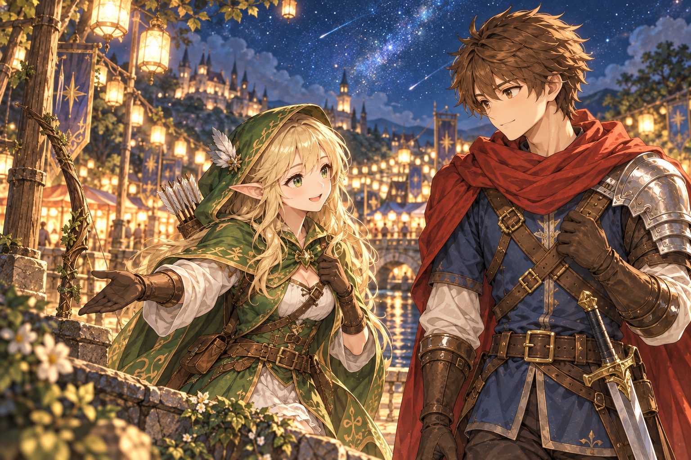

## あなたの分も、淹れるから

ミラが、自分の分の茶葉も量る。

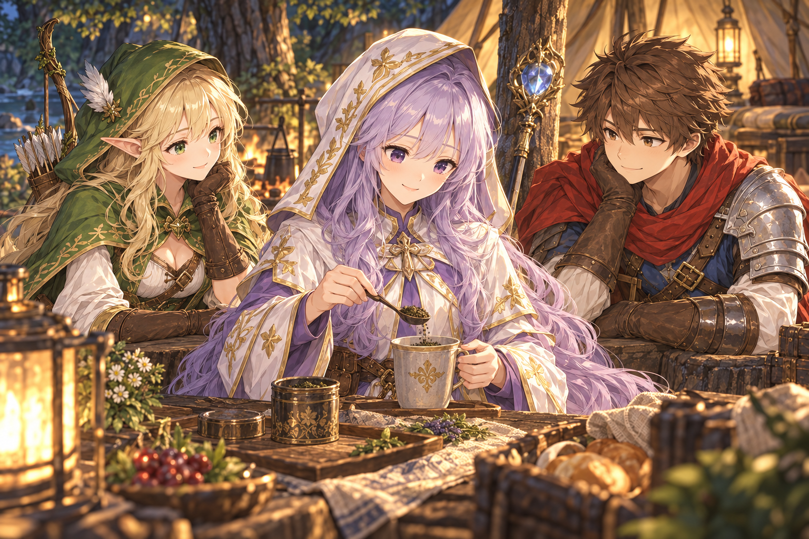

## 最後の荷物

今度はガルが助けてもらう番。レオンが最後の荷物を引き受ける。

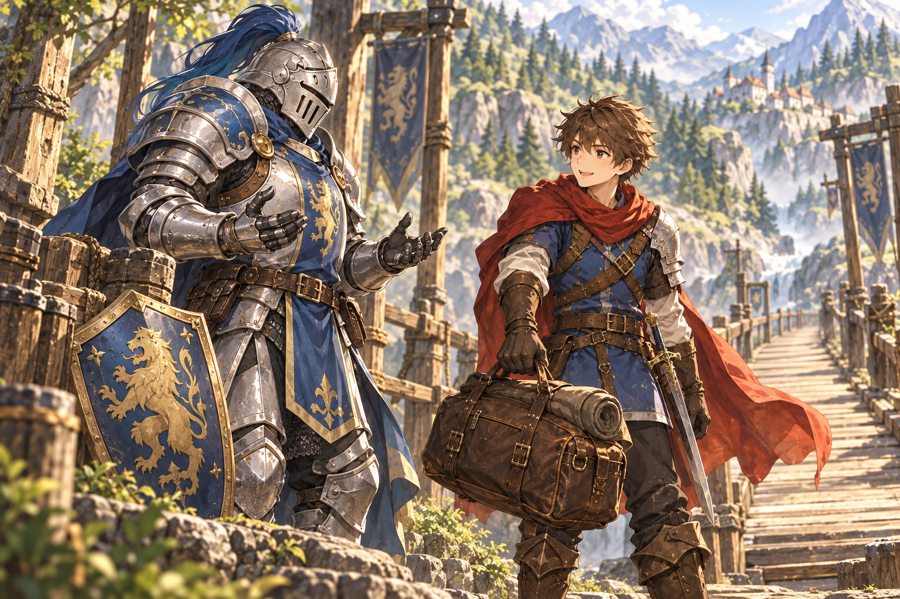

## 星図の余白

ルナが星図に描き込むのは、一緒に星を見た仲間のいた場所。

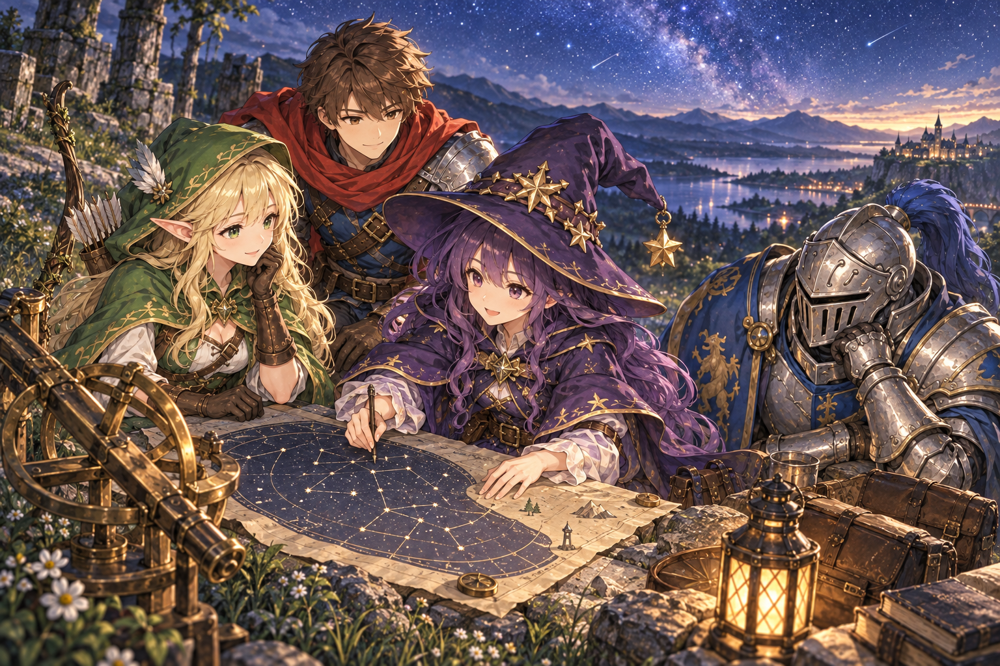

## ひとくち目は、一緒に

ルナが飲み終えた小瓶を見て、ポピーがようやく安心する。

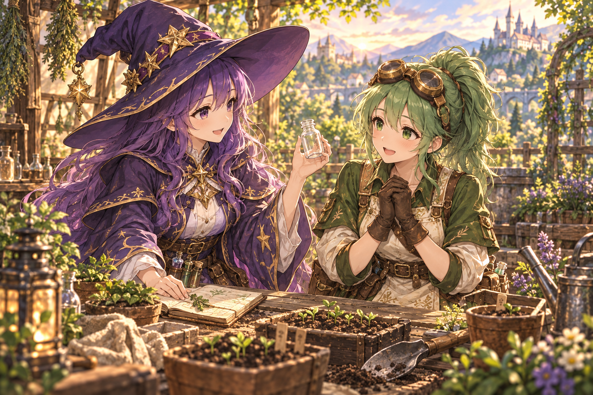

## オリジナルキャラクターの追加スチル

[新しい立ち絵とスチル3枚](original-character-gallery.md)に、メリル×ポピー、プティ×フィン、チャチャ×ミラの会話絵をまとめています。
