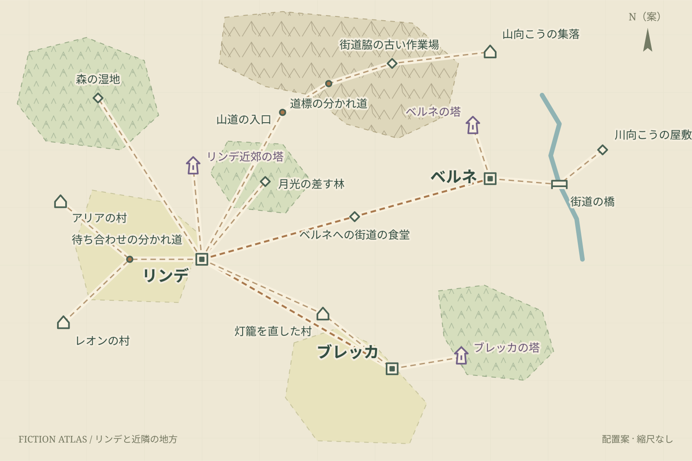

# 設定資料の地図帳

[世界観・シナリオ](../README.md) → 設定資料の地図帳

第一〜第五章の地名と道筋を見渡し、今後の旅先を考えるための制作資料。場所の設定は [世界観](../world-and-story.md#ふたりの暮らしと地理) と各章の本文を参照し、ここでは**作図上の配置案**を管理する。ゲームの地図画面や、正確な距離を測る地図ではない。

## 地図を開く

[地図帳のHTML](view/atlas.html) をダウンロードしてブラウザーで開く。サーバー・アカウント・外部サービスは不要。GitHub上ではHTMLは実行されないので、静止画は [地図一覧](view/README.md) から読む。



| 地図 | 用途 |
| --- | --- |
| [世界図・既知の範囲](view/world.svg) | 既知の地方と、それ以外の未設定の余白。大陸・海岸線・国家を新たに確定しない |
| [リンデと近隣の地方](view/region.svg) | 第一〜第四章の舞台、村・町・山越え・橋の関係 |
| [リンデ・二つの村](view/linde.svg) | 日々の交易、丘の塔、湿地・薬草の林、町の連絡先 |
| [山道と薬の配達先](view/mountain.svg) | 道標、古い作業場、山向こうの集落 |
| [ベルネと川向こう](view/berne.svg) | 石組み、資材置き場、橋・宿・屋敷 |
| [ブレッカと苔床](view/brekka.svg) | 宿・裏通り・塔の裏手と、苗を移した先 |

## 読み方と編集

- 地名をクリックするか検索すると、その場所の説明・根拠の章・資料を表示する。
- 「既存設定」は場所の存在の区分。「配置：制作案」は地図上の座標の区分。場所が本文に登場していても、その方角や距離まで確定したとは扱わない。
- 地形・街道・地名・詳細図の枠は個別に表示を切り替えられる。背景をドラッグして移動し、＋／−で拡大・縮小する。
- 「配置を編集」で地点をドラッグ、または名称・メモ・座標を変更できる。直前の編集は「元に戻す」で取り消せる。移動した地点の配置区分は「制作案」へ戻る。
- ブラウザー上の編集は自動保存されない。「JSONを保存」で持ち出し、次回は「JSONを開く」で読み込む。元ファイルを直接上書きする機能ではない。
- 「HTMLを保存」は編集後の地図帳を単独ファイルにする。「SVGを書き出す」は現在の表示範囲を画像にする。全景を出すときは先に「全体へ戻す」を押す。

編集の正本は [atlas.json](atlas.json)。地点IDと座標は全図で共有する。地方図で町を移動すれば世界図にも同じ変更が出る。地形の輪郭、道の接続、地図の範囲、根拠資料の更新はJSONで行い、HTMLへ読み込む。HTML内の埋め込みデータを直接編集しない。

## 既存資料から守った関係

| 関係 | 根拠 |
| --- | --- |
| 二人は近隣の別々の村から合流し、共通の交易先リンデへ通う | [世界観・村と街](../world-and-story.md#村街塔の関係)、[第一章1-1・1-2](../game-script/chapter-1.md) |
| 最初の塔は街外れの丘。裏手の斜面に古い排水路がある | [第一章1-4・1-7〜1-9](../game-script/chapter-1.md)、[用語集](../../glossary.md) |
| 薬の配達は山道・道標・古い作業場を経て集落へ。帰路は翌朝 | [第二章2-4〜2-9](../game-script/chapter-2.md) |
| リンデからベルネへの道中の食堂でフィンと出会う | [第三章3-1](../game-script/chapter-3.md)。第四章のリンデの食堂と同一扱いしない |
| ベルネには暗い通りを避ける東側の道がある。屋敷へは川を渡る | [第三章3-2・3-4・3-6・3-8](../game-script/chapter-3.md)。屋敷を東岸に置くことは配置案 |
| リンデからブレッカへ向かう途中で村の灯籠を直し、章末にリンデへ戻る | [第四章4-1〜4-3・4-10](../game-script/chapter-4.md) |
| ブレッカの苔床は塔の裏。苗を塔から離れた場所へ移す | [第四章4-6〜4-9](../game-script/chapter-4.md)。離す実距離は未設定 |
| 倉庫の裏に空き地があり、菜園にする。家々の屋根越しに丘の塔が見える | [第五章詳細台本5-3](../chapter-five-script.md#5-3-念のための受付帳)（制作案）。塔までの方角・距離は未設定 |

## 今回置いた配置案と未設定事項

リンデを日々の往来の中心、ベルネを紙面の右上、ブレッカを右下に配置した。二つの村は左側、山越えの配達先は上側に置いた。これは既存設定の方角を発掘した結果ではなく、話の舞台を整理するための提案。

**全35地点の座標、地形の輪郭、街道の線形は制作案。** 道を結ぶ線は移動の関係を表し、縮尺・旅行日数を表さない。地域の遠近や国境を決める根拠に使わない。

- 世界・大陸・国・地方の固有名、海岸線、海の位置、周辺の町は未設定。
- 二つの村、山向こうの集落、灯籠を直した村の固有名は未設定。「アリアの村」などは説明用の呼称。
- 川の流向・源流・河口、橋の宿が川のどちら側にあるかは未設定。
- 第一章の湿地と第二章の薬草の林が同一の森林かは未設定。
- 塔の灯りの厳密な有効範囲は描かない。完全に安全な円形領域があるとは扱わない。
- 第四章後の連絡先は倉庫二階。初期からの共同生活や全員の定住地へ一般化しない。

設定を採用・変更する場合は世界観や対象章の正本を先に更新し、`sources` と `placement` を合わせて更新する。地図を動かしたことだけで物語本文へ採用したことにはしない。

## 汎用ツールと再生成

### シナリオ作業での確認と更新

舞台や移動を扱うプロット・台本・クエストの追加変更では、次の手順を使う。Codexはリポジトリ内の [fiction-atlas](../../../.agents/skills/fiction-atlas/SKILL.md) を使用する。管理方針は [Codexの作業手順](../../development/codex.md) を参照する。

1. **執筆・実装前に確認する。** `atlas.json` と対象の地方図・詳細図を読み、出発地・目的地・経由地、道の接続、川・橋・山越えの関係を把握する。地点の `sources` から世界観・対象章の本文へ戻り、方角・移動時間などの記述を照合する。地図の見た目だけから距離や「同日中に着く」といった条件を決めない。
2. **既存設定と新しい案を区別する。** 同じ場所を別の名前で重複登録していないか、往路・帰路がつながるかを確認する。配置案との不一致だけで本文を変更しない。既存の確定した記述と矛盾する場合は、変更の意図を整理して設定の正本と本文を揃える。新しい配置の検討には `proposal` を使い、地図への追加だけで設定の採用を意味させない。
3. **地理の変更をデータへ反映する。** 新しい町・村・目的地・継続して使う目印、道の接続や地形の変更があれば、世界観・対象章の担当資料と `atlas.json` を同じ作業で更新する。既存地点の改名・移動ではIDを維持し、`sources` に根拠の章・ステージ／シーンを記す。場所の存在と配置の確度を分け、新しい地方には親地図内の表示範囲を追加する。一度だけ登場する室内の小物まで地点にする必要はない。
4. **表示資料を揃えて検証する。** `validate` を通し、単独HTMLを再生成して、更新の影響を受ける世界図・地方図・詳細図のSVGを書き出す。名称・接続・親子範囲・ラベルの見切れ、本文との整合、JSONとHTMLのデータ一致を確認する。クエストID・シーンIDは [用語集](../../glossary.md) と照合する。ゲーム内台本を根拠に使う場合は、会話の変更後に `npm run script:export` で台本も更新する。
5. **同じPRで報告する。** シナリオと一緒に地図データ・生成物・必要な説明を含め、追加変更した場所・道筋と、残した未設定事項を簡潔に報告する。地理に変更がない台詞調整などでは、必要な照合だけ行い、地図の再生成や設定の追加はしない。

### ツールの場所とコマンド

この地図は **[Fiction Atlas (`fiction-atlas`)](../../../.agents/skills/fiction-atlas/SKILL.md)** で作成した。スキル本体・生成器・HTMLテンプレート・データ仕様・テストを `.agents/skills/fiction-atlas/` でGit管理する。内容は本作の設定や固有名に依存せず、他作品ではこのスキル一式を再利用して別のJSONを作れる。本作の地名や設定は地図データ側に置く。

Python標準ライブラリのみで新規データ作成・検査・HTML生成ができる。

```text
python .agents/skills/fiction-atlas/scripts/atlas.py init new-world.json --title "別の作品"
python .agents/skills/fiction-atlas/scripts/atlas.py validate docs/story/atlas/atlas.json
python .agents/skills/fiction-atlas/scripts/atlas.py build docs/story/atlas/atlas.json --out docs/story/atlas/view/atlas.html
python .agents/skills/fiction-atlas/scripts/test_atlas.py
```

スキルがない環境でも、配布済みHTMLだけで閲覧、場所の編集、JSONの読み直しとHTML再保存ができる。静止図はHTMLで各地図を選び、全体表示・選択なし・地形／街道／地名ON・詳細枠OFFでSVGを書き出す。`view/` は生成物なので図やHTMLを直接修正せず、JSONと生成ツールから更新する。

## 確認範囲

2026-09-27の制作時点で、データのID重複・地点参照・地図階層・範囲・表示可能性を検査。スキルの検査、生成HTMLのJavaScript構文、異常データの拒否、埋め込み文字列の保護を検証した。ブラウザーで表示切替、検索、地点詳細、座標編集・取り消しと書き出しを確認。ゲーム本体とセーブ形式は変更しない。
